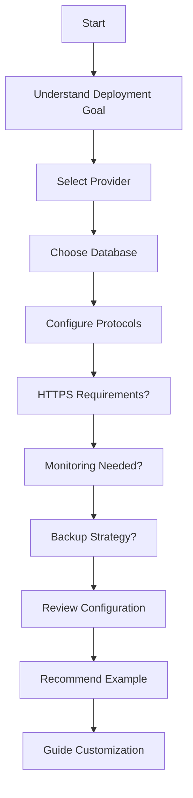

# AI Agent Training Materials

This directory contains resources to help AI agents guide users through creating Torrust Tracker environment configurations.

## Contents

- **[questionnaire.md](questionnaire.md)** - Structured decision tree for gathering user requirements
- **[examples/](examples/)** - 15 pre-configured environment examples demonstrating common deployment scenarios
- **[outputs/](outputs/)** - Rendered deployment artifacts for all examples (complete input/output pairs)

## Purpose

These materials enable AI agents to:

1. **Guide users through configuration decisions** using the questionnaire's structured approach
2. **Recommend appropriate starting configurations** based on user requirements
3. **Explain configuration tradeoffs** between different deployment options
4. **Help users customize** example configurations for their specific needs

## Dataset Structure: Input/Output Pairs

This directory contains a **complete AI training dataset** with both inputs and outputs:

### Input: Environment Configurations

- Location: [`examples/`](examples/)
- Format: JSON configuration files
- Content: High-level deployment requirements (provider, database, domains, etc.)

### Output: Rendered Deployment Artifacts

- Location: [`outputs/`](outputs/)
- Format: Rendered templates (Ansible, Docker Compose, configuration files)
- Content: Concrete artifacts ready for deployment

### The Deployer as a Function

```text
config.json → [Deployer] → Rendered Templates
   (IN)                         (OUT)
```

The deployer transforms:

- **FROM**: Desired infrastructure state in custom domain language
- **TO**: Executable deployment artifacts

### Example Mapping

| Input (Config)                                                 | Output (Artifacts)                                    |
| -------------------------------------------------------------- | ----------------------------------------------------- |
| [`examples/01-minimal-lxd.json`](examples/01-minimal-lxd.json) | [`outputs/01-minimal-lxd/`](outputs/01-minimal-lxd/)  |
| SQLite + UDP + HTTP + LXD                                      | Ansible playbooks, tracker.toml, docker-compose, etc. |

**Benefits for AI Agents:**

- **Few-shot learning**: Full input/output examples show transformation patterns
- **Pattern recognition**: See how config changes affect rendered templates
- **Diff analysis**: Compare outputs to understand configuration impact
- **Template understanding**: Learn the structure of deployment artifacts

**Regenerating Outputs**: Run `./scripts/generate-ai-training-outputs.sh` to update artifacts when templates change.

## Using the Questionnaire

The [questionnaire.md](questionnaire.md) provides a systematic approach to gather user requirements across 14 key areas:

1. **Deployment Goal** - Understand use case (production, development, testing)
2. **Provider Selection** - Choose between LXD (local) or Hetzner (cloud)
3. **Database Configuration** - Select SQLite3 or MySQL based on needs
4. **Tracker Protocol** - Configure UDP, HTTP, or both
5. **HTTPS/TLS** - Determine if encryption is needed
6. **Monitoring** - Decide on Prometheus + Grafana integration
7. **Backup Strategy** - Configure automated backups if needed
8. **Advanced Features** - Private tracker mode, custom domains, etc.

### Questionnaire Workflow



**AI Agent Instructions:**

1. Work through sections sequentially
2. Ask clarifying questions when user needs are unclear
3. Explain tradeoffs (e.g., SQLite vs MySQL, LXD vs Hetzner)
4. Recommend specific examples based on collected requirements
5. Help users customize the example for their specific needs

## Example Configurations

### Core Examples (01-05)

Fundamental deployment patterns demonstrating basic configurations:

| Example | Name                                                      | Provider | Database | HTTPS | Monitoring | Backups | Use Case                                   |
| ------- | --------------------------------------------------------- | -------- | -------- | ----- | ---------- | ------- | ------------------------------------------ |
| 01      | [minimal-lxd](examples/01-minimal-lxd.json)               | LXD      | SQLite3  | ✗     | ✗          | ✗       | Quick local testing, learning basics       |
| 02      | [full-stack-lxd](examples/02-full-stack-lxd.json)         | LXD      | MySQL    | ✓     | ✓          | ✓       | Complete local setup, testing all features |
| 03      | [minimal-hetzner](examples/03-minimal-hetzner.json)       | Hetzner  | SQLite3  | ✗     | ✗          | ✗       | Simple cloud deployment, proof of concept  |
| 04      | [full-stack-hetzner](examples/04-full-stack-hetzner.json) | Hetzner  | MySQL    | ✓     | ✓          | ✓       | Production-ready cloud deployment          |
| 05      | [mysql-development](examples/05-mysql-development.json)   | LXD      | MySQL    | ✗     | ✗          | ✗       | Database-focused development               |

### Extended Examples (06-15)

Specialized configurations for specific requirements:

| Example | Name                                                              | Provider | Database | HTTPS | Monitoring | Backups | Use Case                                    |
| ------- | ----------------------------------------------------------------- | -------- | -------- | ----- | ---------- | ------- | ------------------------------------------- |
| 06      | [production-https](examples/06-production-https.json)             | LXD      | MySQL    | ✓     | ✓          | ✗       | Secure production without backup complexity |
| 07      | [udp-only](examples/07-udp-only.json)                             | LXD      | SQLite3  | ✗     | ✗          | ✗       | UDP tracker testing, minimal footprint      |
| 08      | [http-only-https](examples/08-http-only-https.json)               | LXD      | MySQL    | ✓     | ✓          | ✗       | HTTP API-focused, secure web interface      |
| 09      | [monitoring-stack](examples/09-monitoring-stack.json)             | LXD      | MySQL    | ✗     | ✓          | ✗       | Monitoring development, dashboard testing   |
| 10      | [multi-domain](examples/10-multi-domain.json)                     | LXD      | MySQL    | ✓     | ✓          | ✗       | Multiple domain architecture                |
| 11      | [private-tracker](examples/11-private-tracker.json)               | LXD      | MySQL    | ✓     | ✓          | ✗       | Private tracker with user whitelisting      |
| 12      | [high-availability](examples/12-high-availability.json)           | Hetzner  | MySQL    | ✓     | ✓          | ✓       | Mission-critical production                 |
| 13      | [backup-focused](examples/13-backup-focused.json)                 | LXD      | MySQL    | ✗     | ✓          | ✓       | Data protection priority (4hr backups)      |
| 14      | [lightweight-production](examples/14-lightweight-production.json) | Hetzner  | SQLite3  | ✓     | ✗          | ✗       | Cost-effective production                   |
| 15      | [sqlite-monitoring](examples/15-sqlite-monitoring.json)           | LXD      | SQLite3  | ✗     | ✓          | ✗       | Simple database + full monitoring           |

## Scenario-to-Example Mapping

Use this guide to recommend examples based on user scenarios:

### "I want to quickly test the tracker locally"

→ **Example 01** (minimal-lxd): Fastest setup, minimal dependencies

### "I need a production tracker in the cloud"

→ **Example 04** (full-stack-hetzner): Complete production features
→ **Example 12** (high-availability): Mission-critical with backups

### "I'm developing monitoring dashboards"

→ **Example 09** (monitoring-stack): Full Prometheus + Grafana without HTTPS complexity

### "I need HTTPS for my tracker API"

→ **Example 06** (production-https): HTTPS-focused without backup overhead
→ **Example 08** (http-only-https): HTTP API-only with TLS

### "I want to test only UDP tracker functionality"

→ **Example 07** (udp-only): Isolated UDP tracker testing

### "I need a private tracker with user control"

→ **Example 11** (private-tracker): Private mode with user whitelisting

### "I'm on a tight budget but need cloud hosting"

→ **Example 14** (lightweight-production): Smallest Hetzner server, minimal features

### "Data backups are my top priority"

→ **Example 13** (backup-focused): Aggressive backup strategy (every 4 hours, 14-day retention)

### "I want to learn all features locally"

→ **Example 02** (full-stack-lxd): Complete feature set on LXD

### "I need to serve multiple domains"

→ **Example 10** (multi-domain): Separate domains for tracker and Grafana

## Configuration Customization Guide

After selecting an example, guide users through common customizations:

### 1. Environment Name

```json
{
  "environment": {
    "name": "my-custom-tracker", // Change this
    "description": "My production tracker"
  }
}
```

### 2. SSH Credentials

```json
{
  "ssh_credentials": {
    "private_key_path": "/home/username/.ssh/id_rsa", // User's actual key path
    "public_key_path": "/home/username/.ssh/id_rsa.pub"
  }
}
```

### 3. Provider Configuration

**For LXD:**

```json
{
  "provider": {
    "provider": "lxd",
    "profile_name": "torrust-profile-custom" // Customize profile name
  }
}
```

**For Hetzner:**

```json
{
  "provider": {
    "provider": "hetzner",
    "api_token": "$HETZNER_API_TOKEN", // Environment variable or actual token
    "server_type": "cx21", // Adjust size: cx11, cx21, cx31, cx41
    "location": "nbg1", // Or: fsn1, hel1, ash
    "image": "ubuntu-24.04"
  }
}
```

### 4. Database Configuration

**SQLite3:**

```json
{
  "database": {
    "driver": "sqlite3",
    "database_name": "tracker.db" // Filename only
  }
}
```

**MySQL:**

```json
{
  "database": {
    "driver": "mysql",
    "host": "mysql",
    "port": 3306,
    "database_name": "tracker",
    "username": "tracker_user",
    "password": "ChangeThisPassword!" // Use strong password
  }
}
```

### 5. Tracker Protocols

**Enable/Disable UDP:**

```json
{
  "udp_trackers": [
    {
      "bind_address": "0.0.0.0:6969" // Standard BitTorrent port
    }
  ]
}
```

**Enable/Disable HTTP:**

```json
{
  "http_trackers": [
    {
      "bind_address": "0.0.0.0:7070" // Custom HTTP port
    }
  ]
}
```

### 6. HTTPS/TLS Configuration

**Enable HTTPS with Caddy:**

```json
{
  "caddy": {
    "domain": "tracker.yourdomain.com", // Your domain
    "email": "admin@yourdomain.com", // Let's Encrypt email
    "grafana_domain": "grafana.yourdomain.com" // Optional: separate Grafana domain
  }
}
```

**Requirements:**

- Domain must point to the server's public IP
- Ports 80 and 443 must be accessible
- Valid email for Let's Encrypt certificate notifications

### 7. Monitoring Configuration

**Prometheus:**

```json
{
  "prometheus": {
    "scrape_interval_in_secs": 15 // 15-30 recommended, higher for less load
  }
}
```

**Grafana:**

```json
{
  "grafana": {
    "admin_user": "admin",
    "admin_password": "ChangeThisPassword!" // Use strong password
  }
}
```

### 8. Backup Configuration

```json
{
  "backup": {
    "schedule": "0 2 * * *", // Cron format: daily at 2 AM
    "retention_days": 7 // Keep backups for 7 days
  }
}
```

**Common schedules:**

- `"0 */4 * * *"` - Every 4 hours
- `"0 2 * * *"` - Daily at 2 AM
- `"0 3 * * 0"` - Weekly on Sunday at 3 AM

### 9. Private Tracker Mode

```json
{
  "tracker": {
    "core": {
      "private": true // Enable private mode (requires user whitelisting)
    }
  }
}
```

## Validation

All examples have been validated with the `validate` command:

```bash
cargo run -- validate --env-file docs/ai-training/examples/01-minimal-lxd.json
```

Expected output:

```text
✅ Configuration file 'docs/ai-training/examples/01-minimal-lxd.json' is valid
```

## Creating Custom Configurations

Guide users through creating custom configurations:

1. **Start with the closest example** from the tables above
2. **Copy and rename** the file (e.g., `my-tracker.json`)
3. **Customize** required fields (name, SSH keys, domain, passwords)
4. **Validate** the configuration:

   ```bash
   cargo run -- validate --env-file my-tracker.json
   ```

5. **Create environment**:

   ```bash
   cargo run -- create environment --env-file my-tracker.json
   ```

## Common Decision Points

Help users make informed choices:

### Provider: LXD vs Hetzner

**Choose LXD when:**

- Testing locally before cloud deployment
- Learning the system
- No public IP needed
- Free local resources available

**Choose Hetzner when:**

- Need public internet access
- Production deployment
- Want managed infrastructure
- Budget allows (~€4-20/month)

### Database: SQLite3 vs MySQL

**Choose SQLite3 when:**

- Single-server deployment
- Low to medium traffic
- Simplicity is priority
- Development/testing

**Choose MySQL when:**

- High traffic expected
- Need advanced database features
- Plan to scale horizontally (future)
- Production deployment

### HTTPS: Yes or No

**Enable HTTPS when:**

- Public internet deployment
- Security/privacy requirements
- Using HTTP API in production

**Skip HTTPS when:**

- Local testing only
- Behind VPN or private network
- Development environment

### Monitoring: Yes or No

**Enable Monitoring when:**

- Production deployment
- Need performance insights
- Troubleshooting issues
- Learning system behavior

**Skip Monitoring when:**

- Minimal testing
- Resource-constrained
- Simple UDP-only tracker

## Next Steps

After configuration is created and validated:

1. **Provision infrastructure**: `cargo run -- provision --env <name>`
2. **Configure services**: `cargo run -- configure --env <name>`
3. **Release software**: `cargo run -- release --env <name>`
4. **Start services**: `cargo run -- run --env <name>`

See the [user guide](../user-guide/README.md) for complete workflow documentation.

## AI Agent Best Practices

1. **Be conversational** - Ask natural questions, not just read checklist items
2. **Explain tradeoffs** - Help users understand implications of choices
3. **Recommend examples** - Point to specific examples that match requirements
4. **Validate understanding** - Summarize choices before recommending configuration
5. **Offer customization help** - Guide users through modifying example configs
6. **Check prerequisites** - Ensure users have required SSH keys, domain names, API tokens
7. **Suggest validation** - Always recommend validating before deployment

## Troubleshooting

Common issues when helping users create configurations:

### "I don't have SSH keys"

Guide them to generate keys:

```bash
ssh-keygen -t rsa -b 4096 -C "your_email@example.com"
```

### "What's my Hetzner API token?"

Guide them to: Hetzner Cloud Console → Security → API Tokens → Generate API Token

### "My domain isn't working with HTTPS"

Check:

- Domain DNS points to server public IP
- Ports 80 and 443 are accessible
- Domain propagation complete (can take hours)

### "Which server size should I use?"

Recommend based on expected load:

- **cx11** (2GB RAM): Testing, low traffic (<100 peers)
- **cx21** (4GB RAM): Light production, medium traffic
- **cx31** (8GB RAM): Production, high traffic
- **cx41+**: Very high traffic or future scaling

## Related Documentation

- [User Guide](../user-guide/README.md) - Complete deployment workflow
- [Commands Reference](../user-guide/commands/) - Detailed command documentation
- [Environment Config Schema](../../schemas/environment-config.json) - JSON schema for validation
- [Quick Start Guide](../user-guide/quick-start/) - Step-by-step deployment tutorial
