# Analysis: Current Presentation Layer Structure

## Document Purpose

This document provides an objective analysis of the current `src/presentation/` layer in the Torrust Tracker Deployer project. It is divided into two parts:

1. **Part A**: Description of current structure (what exists)
2. **Part B**: Analysis of the structure (what works, what doesn't)

**Date**: November 6, 2025

---

## Part A: Current Structure Description

### A.1 Directory Structure

```text
src/presentation/
├── cli/                    # CLI argument parsing
│   ├── args.rs            # Global arguments (logging config)
│   ├── commands.rs        # Command definitions (clap)
│   └── mod.rs             # Main Cli struct
├── commands/              # Command execution
│   ├── create/           # Create command
│   │   ├── config_loader.rs
│   │   ├── errors.rs
│   │   ├── handler.rs
│   │   ├── mod.rs
│   │   ├── subcommands/
│   │   │   ├── environment.rs
│   │   │   ├── mod.rs
│   │   │   └── template.rs
│   │   └── tests/
│   ├── destroy/          # Destroy command
│   │   ├── errors.rs
│   │   ├── handler.rs
│   │   ├── mod.rs
│   │   └── tests/
│   ├── constants.rs      # Shared constants
│   ├── context.rs        # Execution context
│   ├── factory.rs        # Dependency injection
│   ├── mod.rs            # Command dispatcher
│   └── tests/
├── user_output/          # User-facing output
│   ├── channel.rs        # Output channel abstraction
│   ├── core.rs           # Main UserOutput struct
│   ├── formatters/       # Output formatters
│   │   ├── json.rs
│   │   └── mod.rs
│   ├── messages/         # Message types
│   │   ├── error.rs
│   │   ├── info_block.rs
│   │   ├── mod.rs
│   │   ├── progress.rs
│   │   ├── result.rs
│   │   ├── steps.rs
│   │   ├── success.rs
│   │   └── warning.rs
│   ├── sinks/            # Output sinks
│   │   ├── file.rs
│   │   ├── mod.rs
│   │   ├── telemetry.rs
│   │   └── writers.rs
│   ├── mod.rs
│   ├── test_support.rs
│   ├── theme.rs          # Visual theme
│   ├── traits.rs         # Output traits
│   └── verbosity.rs      # Verbosity levels
├── errors.rs             # Top-level presentation errors
├── mod.rs                # Layer exports
└── progress.rs           # Progress indicators
```

### A.2 Module Responsibilities

#### cli/ - CLI Argument Parsing

**Purpose**: Parse command-line arguments using clap

**Files**:

- `args.rs`: Global arguments (logging, verbosity)
- `commands.rs`: Subcommand definitions
- `mod.rs`: Main `Cli` struct with clap configuration

**Entry Point**: `Cli::parse()` returns `Cli` struct with parsed commands

**Example**:

```rust
#[derive(Parser, Debug)]
pub struct Cli {
    #[command(flatten)]
    pub global: GlobalArgs,
    
    #[command(subcommand)]
    pub command: Option<Commands>,
}

#[derive(Subcommand, Debug)]
pub enum Commands {
    Create { action: CreateAction },
    Destroy { environment: String },
}
```

#### commands/ - Command Execution

**Purpose**: Execute commands, dispatch to handlers, manage context

**Key Files**:

- `mod.rs`: Contains `execute()` function (dispatcher)
- `context.rs`: Command execution context
- `factory.rs`: Dependency injection factory
- `{command}/handler.rs`: Individual command handlers

**Dispatcher Pattern** (in `commands/mod.rs`):

```rust
pub fn execute(
    command: Commands,
    working_dir: &Path,
    user_output: &Arc<Mutex<UserOutput>>,
) -> Result<(), CommandError> {
    match command {
        Commands::Create { action } => {
            create::handle_create_command(action, working_dir, user_output)?;
        }
        Commands::Destroy { environment } => {
            destroy::handle_destroy_command(&environment, working_dir, user_output)?;
        }
    }
    Ok(())
}
```

**Handler Pattern** (example: `commands/destroy/handler.rs`):

```rust
pub fn handle_destroy_command(
    environment_name: &str,
    working_dir: &Path,
    user_output: &Arc<Mutex<UserOutput>>,
) -> Result<(), DestroySubcommandError> {
    // 1. Setup dependencies (OpenTofu, repository)
    // 2. Execute destroy logic
    // 3. Use user_output for progress/success messages
    // 4. Return result
}
```

#### user_output/ - Output Rendering

**Purpose**: Render user-facing output (messages, progress, results)

**Architecture**: Sink-based output system with channel separation

**Core Components**:

- `UserOutput`: Main output coordinator
- `OutputSink` trait: Abstract output destination
- `Channel`: Stdout vs stderr routing
- `OutputMessage` trait: Message types

**Key Features**:

- Dual-channel output (stdout for results, stderr for progress)
- Multiple sinks (standard output, file, telemetry)
- Verbosity levels
- Theme support

**Example Usage**:

```rust
let mut output = UserOutput::new(VerbosityLevel::Normal);
output.progress("Destroying environment...");
output.success("Environment destroyed successfully");
output.result(r#"{"status": "destroyed"}"#);
```

#### progress.rs - Progress Indicators

**Purpose**: Progress bar and spinner implementations

**Location**: Root of presentation layer (not in subdirectory)

**Note**: This file is somewhat isolated from `user_output/` module

### A.3 Data Flow

#### Request Flow Diagram


#### Detailed Execution Flow (Example: Destroy Command)

```mermaid
sequenceDiagram
    participant User
    participant CLI as cli/
    participant Dispatcher as commands/mod.rs
    participant Handler as commands/destroy/handler.rs
    participant Factory as commands/factory.rs
    participant App as Application Layer
    participant Output as user_output/

    User->>CLI: torrust-tracker-deployer destroy my-env
    CLI->>CLI: Parse arguments
    CLI->>Dispatcher: execute(Commands::Destroy)
    Dispatcher->>Handler: handle_destroy_command()
    Handler->>Factory: Create dependencies
    Factory-->>Handler: OpenTofu, Repository, etc.
    Handler->>Output: progress("Destroying...")
    Output->>User: [stderr] Destroying...
    Handler->>App: DestroyCommand::execute()
    App-->>Handler: Result
    Handler->>Output: success("Destroyed!")
    Output->>User: [stderr] ✓ Destroyed!
    Handler-->>Dispatcher: Ok(())
    Dispatcher-->>CLI: Ok(())
```



### A.4 Module Dependencies


### A.5 Code Organization Patterns

#### Pattern 1: Command Module Structure

Each command follows this structure:

```text
commands/{command}/
├── handler.rs        # Main handler function
├── errors.rs         # Command-specific errors
├── mod.rs            # Module exports
├── subcommands/      # (Optional) Subcommand handlers
└── tests/            # Command tests
```

#### Pattern 2: Handler Function Signature

```rust
pub fn handle_{command}_command(
    // Command-specific arguments
    working_dir: &Path,
    user_output: &Arc<Mutex<UserOutput>>,
) -> Result<(), {Command}SubcommandError>
```

#### Pattern 3: Error Handling

Each command has its own error enum:

```rust
#[derive(Debug, Error)]
pub enum DestroySubcommandError {
    #[error("Error message: {context}")]
    VariantName {
        context: String,
        #[source]
        source: SomeError,
    },
}
```

### A.6 Key Interfaces

#### CLI Interface

```rust
pub struct Cli {
    pub global: GlobalArgs,
    pub command: Option<Commands>,
}

pub enum Commands {
    Create { action: CreateAction },
    Destroy { environment: String },
}
```

#### Dispatcher Interface

```rust
pub fn execute(
    command: Commands,
    working_dir: &Path,
    user_output: &Arc<Mutex<UserOutput>>,
) -> Result<(), CommandError>
```

#### Output Interface

```rust
pub trait OutputSink {
    fn write(&mut self, message: &dyn OutputMessage) -> Result<()>;
    fn flush(&mut self) -> Result<()>;
}

pub trait OutputMessage {
    fn content(&self) -> String;
    fn channel(&self) -> Channel;
}
```

### A.7 Testing Structure

Tests are organized per command:

```text
commands/
├── create/tests/
├── destroy/tests/
└── tests/           # Shared test utilities
```

---

## Part B: Analysis of Current Structure

### B.1 What Works Well ✅

#### B.1.1 CLI Parsing Separation

**Observation**: The `cli/` module is well-isolated.

**Benefits**:

- Clear responsibility (argument parsing only)
- Easy to modify CLI definitions
- Good use of clap's derive API
- Testable independently

**Evidence**:

```rust
// Clear, focused module
// src/presentation/cli/mod.rs
pub mod args;
pub mod commands;

pub use args::GlobalArgs;
pub use commands::{Commands, CreateAction};
```

#### B.1.2 Output Architecture

**Observation**: The `user_output/` module has a sophisticated, well-designed architecture.

**Strengths**:

- Dual-channel output (stdout/stderr)
- Sink-based abstraction (flexible output destinations)
- Message type system (type-safe messages)
- Verbosity levels
- Theme support

**Evidence**: Well-structured submodules with clear responsibilities.

#### B.1.3 Error Handling

**Observation**: Command-specific errors with context and source chaining.

**Benefits**:

- Type-safe error handling
- Rich error context
- Source error preservation
- Aligned with project error handling guidelines

#### B.1.4 Command Isolation

**Observation**: Each command is in its own module with dedicated files.

**Benefits**:

- Easy to find command code
- Clear ownership
- Can be developed independently
- Tests colocated with implementation

### B.2 What Doesn't Work Well ❌

#### B.2.1 Mixed Responsibilities in `commands/`

**Problem**: The `commands/` module contains BOTH:

1. Command dispatcher (`mod.rs::execute()`)
2. Command handlers (`create/`, `destroy/`)
3. Infrastructure concerns (`context.rs`, `factory.rs`)

**Why It's Bad**:

- **Unclear module purpose**: "Is `commands/` for dispatch or handling?"
- **Hard to navigate**: Must understand mixed concerns
- **Difficult to test**: Dispatcher coupled with handlers
- **Poor discoverability**: Where does dispatch logic live?

**Evidence**:

```rust
// src/presentation/commands/mod.rs
// This file contains:
// 1. Module declarations (create, destroy)
// 2. Dispatcher logic (execute function)
// 3. Error handling (handle_error function)
// Too many responsibilities!

pub mod create;
pub mod destroy;
pub mod context;    // Infrastructure
pub mod factory;    // Infrastructure

pub fn execute(...) { /* dispatcher */ }
pub fn handle_error(...) { /* error handling */ }
```

#### B.2.2 No Explicit Routing Layer

**Problem**: Dispatch logic hidden in `commands/mod.rs`, not in dedicated module.

**Why It's Bad**:

- **Not discoverable**: Must know to look in `commands/mod.rs`
- **Hard to extend**: Adding middleware requires modifying `execute()`
- **No clear pattern**: Routing is implicit, not explicit
- **Difficult to test**: Can't mock routing without handlers

**Impact**: Future features (middleware, request logging, etc.) have no clear home.

#### B.2.3 Unclear Naming: `user_output/`

**Problem**: Module name `user_output` is verbose and non-standard.

**Why It's Bad**:

- **Not standard terminology**: Web frameworks use "views" or "renderers"
- **Verbose**: Longer than necessary
- **Less discoverable**: Not immediately clear it's the "view layer"

**Industry Comparison**:

| Project | Output Module Name |
|---------|-------------------|
| cargo | (scattered) |
| ripgrep | `printer` |
| bat | `printer` |
| rustup | (scattered) |
| **Ours** | `user_output` ❌ |
| **Standard** | `views` ✓ or `output` ✓ |

#### B.2.4 Orphaned Module: `progress.rs`

**Problem**: `progress.rs` at presentation root, unclear relationship to `user_output/`.

**Why It's Bad**:

- **Unclear organization**: Should it be in `user_output/`?
- **Discovery issue**: Not obvious it's related to output
- **Inconsistent**: Other output concerns are in `user_output/`

**Location**:

```text
src/presentation/
├── user_output/         # Output rendering
│   └── messages/
│       └── progress.rs  # Wait, progress messages here?
└── progress.rs          # And progress indicators here? Confusing!
```

#### B.2.5 Context and Factory Placement

**Problem**: `context.rs` and `factory.rs` in `commands/` module.

**Why It's Questionable**:

- **Not command-specific**: Used by dispatcher, not handlers directly
- **Infrastructure concerns**: More related to routing/dispatch
- **Unclear relationship**: Why in `commands/` vs. separate module?

**Better Placement**: With dispatcher/routing logic, not with handlers.

#### B.2.6 No Clear Controller Abstraction

**Problem**: Handlers are functions, not following a unified interface.

**Why It's Limiting**:

- **No polymorphism**: Can't treat commands uniformly
- **Hard to extend**: No command trait to implement
- **Testing complexity**: Must mock differently for each command

**Current**:

```rust
// Each handler has different signature
pub fn handle_create_command(action: CreateAction, ...) -> Result<...>
pub fn handle_destroy_command(environment: &str, ...) -> Result<...>
```

**Could Be**:

```rust
pub trait CommandHandler {
    type Input;
    type Output;
    fn execute(&self, input: Self::Input) -> Result<Self::Output>;
}
```

### B.3 Maintainability Issues ⚠️

#### B.3.1 Scalability Concerns

**Current Command Count**: 2 (create, destroy)

**Future Commands** (from roadmap):

- Provision
- Configure
- Release
- Run

**Problem**: As commands grow, `commands/mod.rs` will accumulate:

- More match arms in `execute()`
- More module declarations
- More dispatch logic

**Result**: Central bottleneck file that grows with every command.

#### B.3.2 Testing Complexity

**Issue**: Cannot test dispatcher without handlers.

**Example**:

```rust
// Want to test: Does dispatcher route Destroy correctly?
// Problem: Must have working destroy handler to test routing!

#[test]
fn test_dispatch_destroy() {
    let cmd = Commands::Destroy { environment: "test".into() };
    // This calls actual handler ↓
    execute(cmd, &path, &output)?;  // Can't isolate routing logic!
}
```

**Need**: Mock handler layer to test routing independently.

#### B.3.3 Discoverability for New Contributors

**Scenario**: New contributor wants to add a command.

**Current Process**:

1. Add to `cli/commands.rs` ✓ (clear)
2. Add handler in `commands/{new}/` ✓ (clear)
3. Add dispatch in `commands/mod.rs` ⚠️ (not obvious where)
4. ~~Add output rendering~~ ✓ (use `user_output`)

**Problem**: Step 3 is not obvious. Must know to look in `commands/mod.rs`.

### B.4 Comparison to Best Practices

#### B.4.1 vs. Rust CLI Tools

| Best Practice | Current Implementation | Gap |
|--------------|----------------------|-----|
| Separate CLI parsing | ✅ `cli/` module | None |
| Explicit dispatcher | ❌ Hidden in `commands/mod.rs` | Missing |
| Controller pattern | ⚠️ Functions, not controllers | Partial |
| Dedicated output | ✅ `user_output/` | None |

#### B.4.2 vs. Web Framework Patterns (MVC)

| MVC Layer | Current Equivalent | Assessment |
|-----------|-------------------|------------|
| Router | `commands/mod.rs::execute()` | ❌ Implicit |
| Controller | `commands/{cmd}/handler.rs` | ⚠️ Functions, not controllers |
| View | `user_output/` | ✅ Good |
| Input | `cli/` | ✅ Good |

#### B.4.3 vs. SOLID Principles

**Single Responsibility**:

- ❌ `commands/mod.rs` has multiple responsibilities
- ❌ `commands/` mixes dispatch and handling

**Open/Closed**:

- ⚠️ Adding commands requires modifying `commands/mod.rs`
- ⚠️ No command trait to implement

**Dependency Inversion**:

- ⚠️ Handlers depend on concrete `UserOutput`, not abstraction
- ✅ Uses traits in some places (`OutputSink`)

### B.5 Summary of Issues

#### Critical Issues 🔴

1. **Mixed Responsibilities**: `commands/` module has unclear purpose
2. **No Explicit Router**: Dispatch logic hidden, not discoverable
3. **Scalability**: Central `execute()` grows with every command

#### Moderate Issues 🟡

1. **Naming**: `user_output/` not standard terminology
2. **Orphaned Module**: `progress.rs` location unclear
3. **Testing**: Cannot test routing without handlers

#### Minor Issues 🟢

1. **No Controller Abstraction**: Handlers are functions, not trait impl
2. **Factory Placement**: Should be with routing, not handlers

### B.6 What Should Be Preserved

Despite issues, these elements are working well:

✅ **CLI parsing architecture** (`cli/`)  
✅ **Output system design** (`user_output/`)  
✅ **Error handling approach** (thiserror, structured errors)  
✅ **Command isolation** (separate modules per command)  
✅ **Test organization** (colocated with implementation)

### B.7 Conclusion

The current presentation layer has:

- **Strong foundation**: Good CLI parsing and output systems
- **Mixed concerns**: Dispatch and handling not separated
- **Unclear organization**: Some modules in wrong places
- **Scalability issues**: Will become harder to maintain as commands grow

**Key Insight**: The architecture has good pieces, but they're not organized into clear layers with explicit boundaries.

---

**Analysis completed by**: GitHub Copilot  
**Date**: November 6, 2025  
**Status**: Complete - Ready for design proposal
