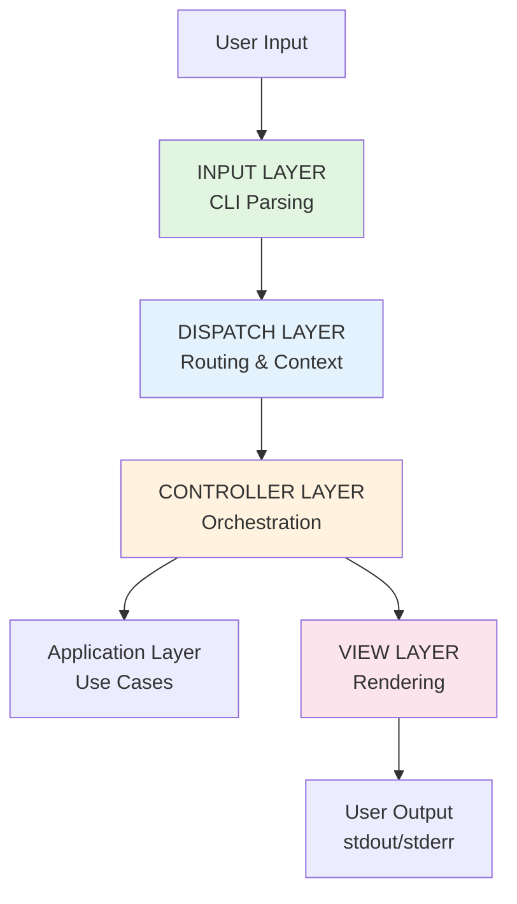
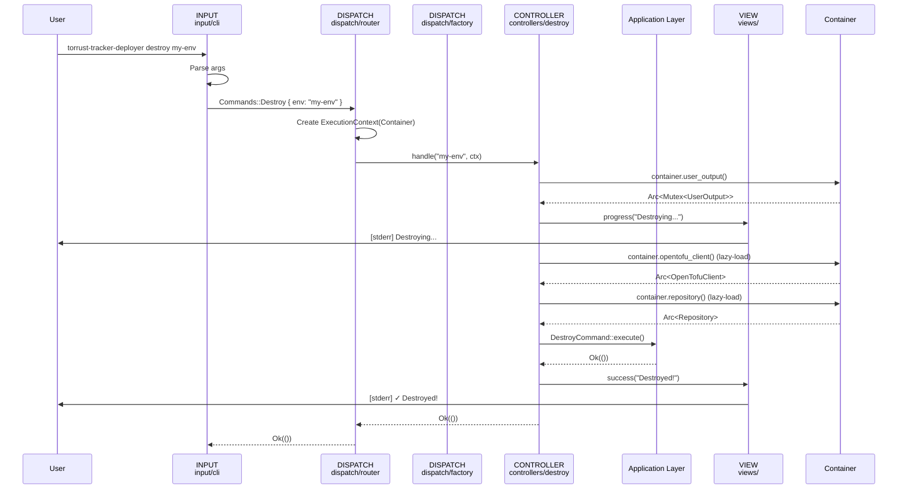
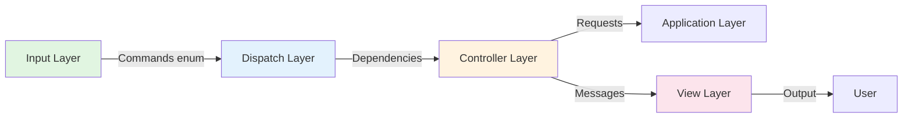

# Design Proposal: Layered Presentation Architecture

## Document Purpose

This document proposes a new design for the `src/presentation/` layer based on:

- Research on CLI organization patterns
- Analysis of current structure
- Industry best practices (MVC/MVT patterns)

**Goal**: Transform the presentation layer into a clear, maintainable, layered architecture.

**Date**: November 6, 2025

---

## 1. Design Overview

### 1.1 Core Principle

**Explicit Four-Layer Architecture** inspired by MVC/MVT patterns:

```text
Input → Dispatch → Controllers → Views
```

Each layer has **one clear responsibility** and **explicit boundaries**.

### 1.2 Visual Architecture



---

## 2. Proposed Directory Structure

### 2.1 Complete Structure

```text
src/presentation/
├── input/                     # INPUT LAYER
│   ├── cli/                  # CLI parsing
│   │   ├── args.rs          # Global arguments
│   │   ├── commands.rs      # Command definitions
│   │   └── mod.rs           # Cli struct
│   └── mod.rs               # Input layer exports
│
├── dispatch/                 # DISPATCH LAYER
│   ├── router.rs            # Command router
│   ├── context.rs           # Execution context (wraps Container)
│   └── mod.rs               # Dispatch layer exports
│
├── controllers/             # CONTROLLER LAYER
│   ├── create/             # Create controller
│   │   ├── handler.rs      # Handler implementation
│   │   ├── subcommands/    # Subcommand handlers
│   │   ├── config_loader.rs
│   │   ├── errors.rs
│   │   ├── tests/
│   │   └── mod.rs
│   ├── destroy/            # Destroy controller
│   │   ├── handler.rs
│   │   ├── errors.rs
│   │   ├── tests/
│   │   └── mod.rs
│   ├── constants.rs        # Shared constants
│   └── mod.rs              # Controller exports
│
├── views/                   # VIEW LAYER
│   ├── formatters/         # Output formatters
│   │   ├── json.rs
│   │   └── mod.rs
│   ├── messages/           # Message types
│   │   ├── error.rs
│   │   ├── info_block.rs
│   │   ├── progress.rs     # Progress messages
│   │   ├── result.rs
│   │   ├── steps.rs
│   │   ├── success.rs
│   │   ├── warning.rs
│   │   └── mod.rs
│   ├── progress/           # Progress indicators
│   │   ├── bar.rs          # (from old progress.rs)
│   │   ├── spinner.rs
│   │   └── mod.rs
│   ├── terminal/           # Terminal I/O
│   │   ├── channel.rs      # Stdout/stderr
│   │   ├── writers.rs      # Output writers
│   │   ├── sinks.rs        # Output sinks
│   │   └── mod.rs
│   ├── core.rs             # UserOutput main struct
│   ├── theme.rs            # Visual theme
│   ├── verbosity.rs        # Verbosity levels
│   ├── traits.rs           # Output traits
│   ├── test_support.rs
│   └── mod.rs              # View layer exports
│
├── errors.rs                # Top-level errors
└── mod.rs                   # Presentation layer exports
```

### 2.2 Migration from Current Structure

```text
CURRENT → PROPOSED

cli/                    → input/cli/
commands/mod.rs         → dispatch/router.rs (dispatcher logic)
commands/context.rs     → dispatch/context.rs (wraps bootstrap/container.rs)
commands/factory.rs     → (removed - use Container from bootstrap/)
commands/create/        → controllers/create/
commands/destroy/       → controllers/destroy/
commands/constants.rs   → controllers/constants.rs
user_output/            → views/ (rename + reorganize)
progress.rs             → views/progress/ (integrate)
```

---

## 3. Layer Specifications

### 3.1 Input Layer (`input/`)

**Responsibility**: Parse and validate user input.

**What It Does**:

- CLI argument parsing (clap)
- Convert raw arguments to `Commands` enum
- Input syntax validation

**What It Does NOT Do**:

- Execute commands
- Access application/domain logic
- Render output

**Key Interface**:

```rust
// src/presentation/input/mod.rs
pub mod cli;

pub use cli::{Cli, Commands, GlobalArgs, CreateAction};

// Main entry point
impl Cli {
    pub fn parse() -> Self {
        Self::parse_from(std::env::args())
    }
}
```

**Example**:

```rust
// User runs: torrust-tracker-deployer destroy my-env

let cli = Cli::parse();
// cli.command = Some(Commands::Destroy { environment: "my-env" })
```

### 3.2 Dispatch Layer (`dispatch/`)

**Responsibility**: Route commands to appropriate controllers.

**What It Does**:

- Pattern match on `Commands` enum
- Create execution context (wraps Container)
- Route to controller handlers
- Handle errors uniformly

**What It Does NOT Do**:

- Implement business logic
- Render output directly
- Know controller internals

**Key Files**:

#### `dispatch/router.rs` - Main Router

```rust
use crate::presentation::input::Commands;
use crate::presentation::controllers;
use crate::presentation::dispatch::ExecutionContext;
use crate::bootstrap::container::Container;

pub fn route_command(
    command: Commands,
    working_dir: &Path,
    container: Container,
) -> Result<(), CommandError> {
    let ctx = ExecutionContext::new(working_dir.to_path_buf(), container);

    match command {
        Commands::Create { action } => {
            controllers::create::handle(action, &ctx)?;
        }
        Commands::Destroy { environment } => {
            controllers::destroy::handle(&environment, &ctx)?;
        }
    }
    Ok(())
}
```

#### `dispatch/context.rs` - Dependency Container Integration

```rust
use crate::bootstrap::container::Container;

/// Execution context for commands
///
/// Wraps the application Container and provides command-specific context.
pub struct ExecutionContext {
    pub working_dir: PathBuf,
    pub container: Container,
}

impl ExecutionContext {
    pub fn new(working_dir: PathBuf, container: Container) -> Self {
        Self { working_dir, container }
    }
}
```

**Note**: Instead of a separate "factory", we use the existing `Container` from `src/bootstrap/container.rs` with lazy-loading pattern. Services are instantiated on-demand using thread-safe `Arc<Mutex<Option<Arc<T>>>>` fields.

**Container Enhancement** (future work):

```rust
// Extend src/bootstrap/container.rs with lazy-loaded services

pub struct Container {
    user_output: Arc<Mutex<UserOutput>>,
    // Lazy-loaded services - None until first requested
    // Arc<Mutex<Option<...>>> provides thread-safe lazy initialization
    opentofu_client: Arc<Mutex<Option<Arc<OpenTofuClient>>>>,
    repository: Arc<Mutex<Option<Arc<dyn EnvironmentRepository>>>>,
}

impl Container {
    pub fn opentofu_client(&self) -> Result<Arc<OpenTofuClient>, ContainerError> {
        let mut guard = self.opentofu_client.lock().unwrap();

        if let Some(client) = guard.as_ref() {
            // Already initialized - return cached clone
            return Ok(Arc::clone(client));
        }

        // First access - build the service (thread-safe initialization)
        let client = Arc::new(OpenTofuClient::new()?);
        *guard = Some(Arc::clone(&client));
        Ok(client)
    }

    pub fn repository(&self) -> Result<Arc<dyn EnvironmentRepository>, ContainerError> {
        let mut guard = self.repository.lock().unwrap();

        if let Some(repo) = guard.as_ref() {
            return Ok(Arc::clone(repo));
        }

        // Build repository with dependencies (thread-safe initialization)
        let repo: Arc<dyn EnvironmentRepository> = Arc::new(
            JsonEnvironmentRepository::new(/* ... */)?
        );
        *guard = Some(Arc::clone(&repo));
        Ok(repo)
    }
}
```

**Why `Arc<Mutex<Option<Arc<T>>>>`?**

This pattern provides thread-safe lazy initialization, which is important because:

1. **Parallel task execution**: Commands may execute internal tasks concurrently (e.g., rendering OpenTofu and Ansible templates in parallel during provisioning)
2. **Thread-safe lazy-loading**: Multiple threads can safely request services concurrently without data races
3. **Future-proof**: Ready for parallelism at the task level, even though only one command runs at a time
4. **Correct semantics**: Mutex protects the Option during check-and-initialize, then returns Arc for shared ownership

**Example - Parallel template rendering**:

```rust
// In provision command handler - tasks run in parallel
let (tofu_templates, ansible_templates) = tokio::join!(
    async { ctx.container.opentofu_client()?.render_templates() },  // Thread 1
    async { ctx.container.ansible_client()?.render_templates() },   // Thread 2
);
// Both threads can safely lazy-load their clients concurrently
```

**Benefits**:

- Efficient: Only instantiate services actually used by the command
- Short-lived CLI: Perfect for one-command-per-execution model
- Centralized: All service initialization in one place
- Testable: Easy to mock services in container
- Lazy: No upfront cost for unused services

### 3.3 Controller Layer (`controllers/`)

**Responsibility**: Orchestrate command execution.

**What It Does**:

- Coordinate application/domain layers
- Handle command-specific logic
- Use views for output
- Transform results for presentation

**What It Does NOT Do**:

- Parse CLI arguments
- Implement domain logic
- Directly write to stdout/stderr
- Format output (delegates to views)

**Key Pattern**:

Each controller is a module with:

```text
controllers/{command}/
├── handler.rs        # Main handler function
├── errors.rs         # Command-specific errors
├── tests/           # Controller tests
└── mod.rs           # Exports
```

**Handler Signature**:

```rust
pub fn handle(
    // Command-specific arguments
    ctx: &ExecutionContext,
) -> Result<(), {Command}Error>
```

**Example** (`controllers/destroy/handler.rs`):

```rust
use crate::application::commands::destroy::DestroyCommand;
use crate::presentation::dispatch::ExecutionContext;

pub fn handle(
    environment_name: &str,
    ctx: &ExecutionContext,
) -> Result<(), DestroyError> {
    // 1. Get user output from container
    let user_output = ctx.container.user_output();

    // 2. Show progress
    user_output.lock().unwrap().progress("Destroying environment...");

    // 3. Get lazy-loaded dependencies from container
    let opentofu = ctx.container.opentofu_client()?;
    let repository = ctx.container.repository()?;

    // 4. Execute application logic
    let destroy_cmd = DestroyCommand::new(opentofu, repository);
    destroy_cmd.execute(environment_name)?;

    // 5. Show success
    user_output.lock().unwrap().success("Environment destroyed successfully");

    Ok(())
}
```

**Benefits**:

- Clear orchestration role
- Easy to test (mock application layer)
- Consistent pattern across commands
- Single responsibility

### 3.4 View Layer (`views/`)

**Responsibility**: Render all user-facing output.

**What It Does**:

- Format messages (error, success, progress, etc.)
- Manage progress indicators (bars, spinners)
- Handle terminal I/O (stdout/stderr channels)
- Support multiple output formats (text, JSON)
- Apply themes and styling

**What It Does NOT Do**:

- Execute business logic
- Access domain/application directly
- Parse user input

**Key Structure**:

```text
views/
├── messages/          # Message types (ErrorMessage, SuccessMessage, etc.)
├── progress/          # Progress indicators (bars, spinners)
├── terminal/          # Terminal I/O (channels, writers, sinks)
├── formatters/        # Output formatters (JSON, plain text)
├── core.rs            # UserOutput coordinator
├── theme.rs           # Visual theme
├── verbosity.rs       # Verbosity levels
└── traits.rs          # Output traits
```

**Main Interface** (`views/core.rs`):

```rust
pub struct UserOutput {
    sinks: Vec<Box<dyn OutputSink>>,
    verbosity: VerbosityLevel,
    theme: Theme,
}

impl UserOutput {
    pub fn progress(&mut self, message: &str) {
        let msg = ProgressMessage::new(message);
        self.write(&msg);
    }

    pub fn success(&mut self, message: &str) {
        let msg = SuccessMessage::new(message);
        self.write(&msg);
    }

    pub fn error(&mut self, message: &str) {
        let msg = ErrorMessage::new(message);
        self.write(&msg);
    }

    pub fn result(&mut self, data: &str) {
        let msg = ResultMessage::new(data);
        self.write(&msg);
    }
}
```

**Benefits**:

- All output in one place
- Consistent formatting
- Easy to add new message types
- Easy to change themes/formats

---

## 4. Data Flow in New Design

### 4.1 Request Flow Diagram



### 4.2 Layer Interaction



---

## 5. Benefits of New Design

### 5.1 Addresses Current Problems

| Problem                               | Solution                                  |
| ------------------------------------- | ----------------------------------------- |
| Mixed responsibilities in `commands/` | Clear layers with single responsibilities |
| No explicit router                    | Dedicated `dispatch/router.rs`            |
| Unclear naming (`user_output/`)       | Standard terminology (`views/`)           |
| Orphaned `progress.rs`                | Integrated into `views/progress/`         |
| Context placement unclear             | `dispatch/context.rs` wraps Container     |
| Unused Factory                        | Use existing Container from `bootstrap/`  |
| Scalability concerns                  | Router scales linearly with commands      |
| Testing complexity                    | Each layer mockable independently         |
| Discoverability                       | Clear structure, obvious where code goes  |

### 5.2 Improves Maintainability

**Clear Responsibilities**:

- Adding a command: obvious where to add code
- Changing routing: modify `dispatch/router.rs`
- New output format: add to `views/formatters/`

**Better Testing**:

```rust
// Test routing without controllers
#[test]
fn test_router() {
    let cmd = Commands::Destroy { environment: "test".into() };
    // Mock controller
    let result = route_command(cmd, mock_context);
    assert!(result.is_ok());
}

// Test controller without dispatch
#[test]
fn test_destroy_controller() {
    let mock_app = MockApplication::new();
    let mock_view = MockView::new();

    let result = destroy::handle("test", &path, &mock_view);

    assert!(result.is_ok());
    assert!(mock_view.success_called());
}
```

**Easy Extension**:

```rust
// Future: Add middleware in dispatch layer
pub fn route_command(cmd: Commands, working_dir: &Path, container: Container) -> Result<()> {
    // Pre-middleware
    validate_command(&cmd)?;
    log_command(&cmd)?;

    let ctx = ExecutionContext::new(working_dir.to_path_buf(), container);

    // Route
    match cmd {
        Commands::NewCommand { .. } => controllers::new_command::handle(&ctx)?,
        // ...
    }

    // Post-middleware
    audit_command(&cmd)?;
    Ok(())
}
```

### 5.3 Follows Industry Standards

**Web Framework Alignment**:

| Web MVC         | Our CLI          | Purpose           |
| --------------- | ---------------- | ----------------- |
| Request Parsing | Input Layer      | Parse user input  |
| Router          | Dispatch Layer   | Route to handlers |
| Controller      | Controller Layer | Orchestrate logic |
| View/Template   | View Layer       | Render output     |

**SOLID Principles**:

- ✅ **Single Responsibility**: Each layer has one job
- ✅ **Open/Closed**: Easy to extend (new commands, formatters)
- ✅ **Liskov Substitution**: Controllers interchangeable
- ✅ **Interface Segregation**: Small, focused interfaces
- ✅ **Dependency Inversion**: Depend on traits, not concrete types

### 5.4 Container Integration

**Reuses Existing Infrastructure**: The proposal integrates with `src/bootstrap/container.rs` instead of creating a new dependency injection mechanism.

**Thread-Safe Lazy Loading Pattern**: Services are instantiated on-demand using `Arc<Mutex<Option<Arc<T>>>>`:

```rust
// Container only builds services when first requested
let opentofu = ctx.container.opentofu_client()?;  // Built on first call (thread-safe)
let opentofu2 = ctx.container.opentofu_client()?; // Returns cached instance

// Multiple threads can safely request services concurrently
let (tofu, ansible) = tokio::join!(
    async { ctx.container.opentofu_client() },  // Thread-safe lazy load
    async { ctx.container.ansible_client() },   // Thread-safe lazy load
);
```

**Benefits for CLI with Internal Parallelism**:

- ✅ **No upfront cost**: Don't build services the command won't use
- ✅ **Thread-safe**: Multiple threads can safely lazy-load services concurrently
- ✅ **Efficient**: Single command execution, then exit
- ✅ **Parallel tasks**: Commands can execute internal operations in parallel (e.g., template rendering)
- ✅ **Simple**: One container for entire application lifecycle
- ✅ **Testable**: Easy to provide mock container with test doubles

**Example** - Command only pays for what it uses:

```bash
# Create command: Uses Container services: user_output, repository, config_loader
$ torrust-tracker-deployer create environment my-env.json
# Container doesn't instantiate: opentofu_client, ansible_client (unused)

# Destroy command: Uses Container services: user_output, repository, opentofu_client
$ torrust-tracker-deployer destroy my-env
# Container doesn't instantiate: config_loader, ansible_client (unused)
```

### 5.5 Scalability

**Current**: Commands added to single `execute()` function.

```rust
// Current: commands/mod.rs
pub fn execute(cmd: Commands, ...) -> Result<()> {
    match cmd {
        Commands::Create { .. } => { /* ... */ }
        Commands::Destroy { .. } => { /* ... */ }
        Commands::NewCmd1 { .. } => { /* ... */ }  // Line 15
        Commands::NewCmd2 { .. } => { /* ... */ }  // Line 18
        Commands::NewCmd3 { .. } => { /* ... */ }  // Line 21
        // File grows linearly, all in one place
    }
}
```

**Proposed**: Dedicated router, clear pattern.

```rust
// Proposed: dispatch/router.rs
pub fn route_command(cmd: Commands, ctx: Context) -> Result<()> {
    match cmd {
        Commands::Create { .. } => controllers::create::handle(..),
        Commands::Destroy { .. } => controllers::destroy::handle(..),
        Commands::NewCmd { .. } => controllers::new_cmd::handle(..),  // Easy!
        // Router stays simple, controllers isolated
    }
}
```

---

## 6. Comparison to Alternatives

### 6.1 Alternative A: Keep Current Structure

**Pros**:

- No migration effort
- Familiar to current team

**Cons**:

- Mixed concerns remain
- Scalability issues
- Hard to onboard new contributors
- Doesn't follow industry patterns

**Verdict**: ❌ Short-term gain, long-term pain

### 6.2 Alternative B: Flat Structure (fd-style)

```text
src/presentation/
├── cli.rs
├── commands/
└── output.rs
```

**Pros**:

- Simple
- Easy to navigate

**Cons**:

- Doesn't scale to 5+ commands
- Mixes routing and handling
- Torrust has roadmap for many commands

**Verdict**: ⚠️ Too simple for our needs

### 6.3 Alternative C: Multi-Crate (ripgrep-style)

```text
crates/
├── cli/
├── commands/
├── output/
└── core/
```

**Pros**:

- Maximum isolation
- Reusable components

**Cons**:

- High complexity
- Overkill for CLI app
- Adds build complexity

**Verdict**: ⚠️ Over-engineered for our scale

### 6.4 Proposed D: Four-Layer (This Proposal)

```text
src/presentation/
├── input/
├── dispatch/
├── controllers/
└── views/
```

**Pros**:

- ✅ Clear separation of concerns
- ✅ Industry-standard patterns
- ✅ Scales well
- ✅ Easy to test
- ✅ Familiar terminology
- ✅ Appropriate complexity

**Cons**:

- ⚠️ Migration effort (~12-18 hours)
- ⚠️ More directories than current

**Verdict**: ✅ Best balance for our needs

---

## 7. Trade-offs and Limitations

### 7.1 Increased Directory Nesting

**Trade-off**: More directories vs. clearer organization

**Current**: 3 main directories (cli, commands, user_output)  
**Proposed**: 4 main directories (input, dispatch, controllers, views)

**Assessment**: Worth it for clarity

### 7.2 Import Path Changes

**Trade-off**: Breaking changes vs. better organization

**Current**:

```rust
use crate::presentation::commands::destroy::handle_destroy_command;
use crate::presentation::user_output::UserOutput;
```

**Proposed**:

```rust
use crate::presentation::controllers::destroy::handle;
use crate::presentation::views::UserOutput;
```

**Mitigation**: Phased migration with re-exports (see Refactor Plan)

### 7.3 Learning Curve

**Trade-off**: Initial learning vs. long-term maintainability

**Impact**: New contributors need to understand layer pattern

**Mitigation**:

- Clear documentation
- Architecture diagrams
- Consistent patterns
- Industry-standard terminology

### 7.4 No Controller Trait (Yet)

**Current Proposal**: Keep handlers as functions

```rust
pub fn handle(...) -> Result<()>
```

**Alternative**: Introduce controller trait

```rust
pub trait Controller {
    type Input;
    fn execute(&self, input: Self::Input) -> Result<()>;
}
```

**Decision**: Start with functions, evolve to traits if needed

**Rationale**:

- Simpler migration
- Less boilerplate initially
- Can add trait later without restructuring
- Functions are idiomatic Rust

---

## 8. Success Criteria

### 8.1 Technical Criteria

- [ ] All layers have clear, single responsibilities
- [ ] Explicit router in `dispatch/` layer
- [ ] Controllers isolated in `controllers/` layer
- [ ] All output in `views/` layer
- [ ] No orphaned modules
- [ ] All tests passing
- [ ] Import paths updated

### 8.2 Code Quality Criteria

- [ ] Linters pass (markdown, rust, etc.)
- [ ] Documentation updated
- [ ] Architecture diagrams current
- [ ] Code follows project conventions

### 8.3 Maintainability Criteria

- [ ] New contributors can find code easily
- [ ] Adding commands is straightforward
- [ ] Routing logic is explicit
- [ ] Each layer testable independently

---

## 9. Conclusion

### 9.1 Summary

This proposal transforms the presentation layer from:

- ❌ Mixed concerns and implicit routing
- ✅ To clear, layered architecture with explicit boundaries

### 9.2 Key Improvements

1. **Explicit routing** - Dedicated `dispatch/` layer
2. **Clear organization** - Four distinct layers
3. **Standard terminology** - `views/` instead of `user_output/`
4. **Integrated modules** - No more orphaned files
5. **Better scalability** - Easy to extend
6. **Industry alignment** - Follows MVC/MVT patterns

### 9.3 Next Steps

1. ✅ Research completed
2. ✅ Current structure analyzed
3. ✅ New design proposed
4. ⏭️ **Next**: Create refactor plan with safe migration steps
5. ⏭️ **Then**: Create GitHub issue for implementation

---

**Proposal by**: GitHub Copilot  
**Date**: November 6, 2025  
**Status**: Ready for review and refactor planning
