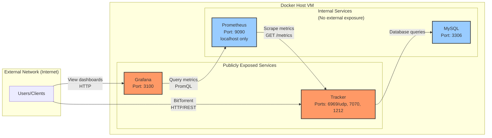

# Docker Network Segmentation Analysis

**Date**: 2025-12-22  
**Related Issue**: [#248 - Docker and UFW Firewall Security Strategy](https://github.com/torrust/torrust-tracker-deployer/issues/248)

## Current Architecture Problem

All services currently share a single `backend_network`, which violates the principle of least privilege. If any service is compromised, the attacker gains network-level access to ALL other services.

## Service Communication Requirements

### Tracker Service

**Needs to communicate with**:

- `mysql` (port 3306) - **Required if using MySQL driver**
  - Purpose: Database operations (torrents, peers, statistics)
  - Direction: Tracker → MySQL
  - Protocol: MySQL protocol

**Does NOT need to communicate with**:

- `prometheus` - Prometheus scrapes metrics FROM tracker, not the other way
- `grafana` - No direct communication needed

### Prometheus Service

**Needs to communicate with**:

- `tracker` (port {{ ports.http_api_port }}) - **Required for metric collection**
  - Purpose: Scrape metrics from tracker's REST API endpoint
  - Direction: Prometheus → Tracker
  - Protocol: HTTP GET requests to `/metrics` or similar endpoint

**Does NOT need to communicate with**:

- `mysql` - No direct database access needed
- `grafana` - Grafana queries Prometheus, not the other way

### Grafana Service

**Needs to communicate with**:

- `prometheus` (port 9090) - **Required for visualization**
  - Purpose: Query metrics data from Prometheus
  - Direction: Grafana → Prometheus
  - Protocol: HTTP (PromQL queries)

**Does NOT need to communicate with**:

- `tracker` - Grafana reads data through Prometheus, not directly
- `mysql` - Grafana has no need for direct database access

### MySQL Service

**Needs to communicate with**:

- `tracker` - **Only accepts connections FROM tracker**
  - Purpose: Respond to database queries
  - Direction: Accepts connections from Tracker
  - Protocol: MySQL protocol

**Does NOT need to communicate with**:

- `prometheus` - No metric scraping at database level
- `grafana` - No direct visualization from database

## Communication Flow Diagram



## Security Risk Analysis

### Critical Security Context: Credentials and Authentication

#### Tracker Contains Database Credentials

**IMPORTANT**: The Tracker service stores MySQL database credentials in multiple locations:

1. **Environment Variables**:

   - `MYSQL_ROOT_PASSWORD` (injected from `.env` file)
   - Other database connection parameters

2. **Configuration Files**:

   - `torrust-tracker.toml` or equivalent configuration may contain database credentials
   - Mounted at `./storage/tracker/etc:/etc/torrust/tracker:Z`

3. **Additional Secrets**:
   - `TORRUST_TRACKER_CONFIG_OVERRIDE_HTTP_API__ACCESS_TOKENS__ADMIN` (API admin token)

**Security Implication**: If Tracker is compromised, the attacker gains:

- ✅ Network access to MySQL (by design - required for tracker operation)
- ✅ MySQL credentials (from environment variables or configuration files)
- ✅ API admin tokens (for tracker REST API access)

**Conclusion**: Tracker compromise = MySQL compromise (regardless of network segmentation)

#### Prometheus Has NO Authentication

**CRITICAL**: Prometheus has no authentication mechanism by default:

- **Port binding**: `127.0.0.1:9090:9090` (localhost only - NOT exposed externally)
- **Security model**: "Security through obscurity" - relies on network isolation only
- **If reached**: Attacker can query ALL metrics data, modify configuration, use as pivot point

**What metrics data contains**:

- Tracker performance statistics
- Request rates and patterns
- Error rates and types
- Internal service topology
- **Potentially**: Sensitive information in metric labels (usernames, IPs, torrent hashes)

**Security Implication**: If an attacker gains network access to Prometheus:

- ✅ Read all metrics data (information disclosure)
- ✅ Query historical data (reconnaissance)
- ✅ Modify Prometheus configuration (if write access enabled)
- ✅ Use Prometheus as a pivot point to scan other services

**Why localhost binding is CRITICAL**:

```yaml
# SECURE: Localhost only - accessible from host for SSH debugging
ports:
  - "127.0.0.1:9090:9090"

# INSECURE: Would expose unauthenticated Prometheus to internet
ports:
  - "9090:9090"  # ❌ NEVER DO THIS
```

**Conclusion**: Prometheus must NEVER be externally accessible without authentication/authorization layer (reverse proxy with auth)

### Current Risk: Single Network

**Vulnerability**: All services share `backend_network`

| Compromised Service        | Network Access          | Has Credentials?  | Effective Risk  | Attack Complexity                           |
| -------------------------- | ----------------------- | ----------------- | --------------- | ------------------------------------------- |
| **Tracker (public)**       | ✅ MySQL                | ✅ YES (env vars) | 🔴 **CRITICAL** | Single compromise                           |
| **Grafana (public)**       | ✅ MySQL, ✅ Prometheus | ❌ NO             | 🟡 MEDIUM       | Need credentials for MySQL                  |
| **Prometheus (localhost)** | ✅ MySQL, ✅ Tracker    | ❌ NO auth        | 🟡 MEDIUM       | If localhost bypass or container compromise |

**Key Risks**:

1. **Grafana → Prometheus**: Grafana compromise gives access to unauthenticated Prometheus (info disclosure)
2. **Grafana → MySQL**: Grafana compromise allows MySQL brute force attempts
3. **Prometheus → MySQL**: If Prometheus compromised, can attempt MySQL authentication
4. **Prometheus → Tracker**: If Prometheus compromised, can abuse Tracker APIs

### Attack Scenario Examples

#### Scenario 1: Grafana Compromised - Accesses Unauthenticated Prometheus (Current: Single Network)

**Attack Path WITHOUT Network Segmentation**:

1. Attacker exploits Grafana vulnerability (CVE in grafana/grafana:11.4.0)
2. Gains shell access: `docker exec grafana /bin/sh`
3. **Access Prometheus (NO AUTH)**: `curl http://prometheus:9090/api/v1/query?query=up` → **succeeds** ❌
4. **Data exfiltration**:
   - Query all metrics: `curl http://prometheus:9090/api/v1/query?query={__name__=~".+"}`
   - Download historical data: `curl http://prometheus:9090/api/v1/query_range`
   - Enumerate services and topology from metrics
   - Extract sensitive information from metric labels

**Risk Level**: 🔴 HIGH - NO authentication barrier, immediate information disclosure

**Attack Path WITH Network Segmentation**:

1. Attacker exploits Grafana vulnerability
2. Gains shell access: `docker exec grafana /bin/sh`
3. Try to access Prometheus: `curl http://prometheus:9090` → **network unreachable** ✅
4. **Attack blocked** - Cannot reach Prometheus from Grafana network

**Risk Level**: 🟢 LOW - Network segmentation prevents access to unauthenticated service

#### Scenario 2: Grafana Compromised - Attempts MySQL Access (Current: Single Network)

#### Scenario 2: Grafana Compromised - Attempts MySQL Access (Current: Single Network)

**Attack Path WITHOUT Network Segmentation**:

1. Attacker exploits Grafana vulnerability (CVE in grafana/grafana:11.4.0)
2. Gains shell access: `docker exec grafana /bin/sh`
3. Network access to MySQL: `telnet mysql 3306` → **succeeds** ❌
4. **Credentials needed**: Attacker must find MySQL password
   - Try default passwords: `root/root`, `admin/admin`
   - Brute force attack (slow but possible)
   - Social engineering to get `.env` file
   - Exploit another vulnerability to read Tracker's environment

**Risk Level**: 🟡 MEDIUM - Attack requires TWO steps (network access + credentials)

**Attack Path WITH Network Segmentation**:

1. Attacker exploits Grafana vulnerability
2. Gains shell access: `docker exec grafana /bin/sh`
3. Try to access MySQL: `telnet mysql 3306` → **network unreachable** ✅
4. **Attack blocked** - Cannot reach MySQL even with credentials

**Risk Level**: 🟢 LOW - Single service compromise is contained

#### Scenario 3: Tracker Compromised (Any Network Configuration)

**Attack Path** (network segmentation doesn't help):

1. Attacker exploits Tracker vulnerability
2. Gains shell access: `docker exec tracker /bin/sh`
3. Read environment: `env | grep MYSQL` → **gets password** ❌
4. OR read config: `cat /etc/torrust/tracker/torrust-tracker.toml` → **gets password** ❌
5. Access MySQL: `mysql -h mysql -u root -p<password>` → **succeeds** ❌

**Risk Level**: 🔴 CRITICAL - Game over for MySQL

**Mitigation**: This is unavoidable by design. Tracker NEEDS both:

- Network access to MySQL
- MySQL credentials to authenticate

**Defense Strategy**:

- Harden Tracker container security (minimal base image, no shell, read-only filesystem where possible)
- Monitor Tracker for suspicious activity
- Use secrets management (Docker secrets, HashiCorp Vault) instead of plain env vars
- Implement database access logging and alerting
- Regular security updates for Tracker image

### Key Insight: Network Segmentation Value

**Question**: Does network segmentation add value when Tracker (which needs MySQL) also has the credentials?

**Answer**: **YES - Network segmentation still provides significant value**:

1. **Isolates Grafana from Database**:

   - Grafana has NO MySQL credentials
   - Compromising Grafana alone cannot access database
   - Attacker must compromise BOTH Grafana AND Tracker to reach MySQL

2. **Reduces Attack Surface**:

   - Only 1 service (Tracker) can access MySQL, not 3 services
   - Fewer pathways to database = fewer opportunities for attackers

3. **Defense in Depth**:

   - Network segmentation is ONE layer
   - Even if attacker has credentials, they need network access
   - Grafana compromise doesn't automatically give MySQL network access

4. **Limits Lateral Movement**:

   - Compromised Grafana cannot pivot to MySQL
   - Compromised Prometheus cannot pivot to MySQL
   - Attack chain must go: Grafana → Tracker → MySQL (3 steps, not 2)

5. **Audit Trail**:
   - All MySQL connections come from Tracker
   - Unexpected MySQL connection from Grafana/Prometheus = immediate alert

**Revised Risk Matrix WITH Network Segmentation**:

1. **Attacker compromises Grafana** (public service at port 3100)

   - Exploits a Grafana vulnerability (CVE in grafana/grafana image)
   - Gains shell access inside Grafana container

2. **Lateral movement via shared network**

   - From Grafana container: `telnet mysql 3306` - **succeeds** ❌
   - Attacker can now attempt MySQL authentication attacks
   - Attacker can perform network reconnaissance: `nmap -p- mysql`

3. **With network segmentation**
   - From Grafana container: `telnet mysql 3306` - **network unreachable** ✅
   - Attack is contained to the grafana_network

**Revised Risk Matrix WITH Network Segmentation**:

| Compromised Service | Network Access | Has Credentials? | Can Attack MySQL? | Notes                               |
| ------------------- | -------------- | ---------------- | ----------------- | ----------------------------------- |
| **Tracker**         | ✅ YES         | ✅ YES           | ✅ YES            | By design - unavoidable             |
| **Grafana**         | ❌ NO          | ❌ NO            | ❌ NO             | **Blocked by network segmentation** |
| **Prometheus**      | ❌ NO          | ❌ NO            | ❌ NO             | **Blocked by network segmentation** |

**Conclusion**: Network segmentation reduces MySQL attack vectors from **3 services** to **1 service** (Tracker only).

## Revised Recommendation: Network Segmentation is ESSENTIAL

Given that Tracker contains MySQL credentials, network segmentation becomes **MORE important**, not less:

- **Without segmentation**: 3 potential pathways to MySQL (Tracker, Grafana, Prometheus)
- **With segmentation**: 1 pathway to MySQL (Tracker only - which needs it by design)

### Additional Security Recommendations

Beyond network segmentation, implement these credential protection measures:

1. **Docker Secrets** (instead of environment variables):

   ```yaml
   services:
     tracker:
       secrets:
         - mysql_password
         - tracker_admin_token
       environment:
         - MYSQL_PASSWORD_FILE=/run/secrets/mysql_password

   secrets:
     mysql_password:
       file: ./secrets/mysql_password.txt
   ```

2. **Read-Only Root Filesystem** (where possible):

   ```yaml
   tracker:
     read_only: true
     tmpfs:
       - /tmp
   ```

3. **Drop Capabilities**:

   ```yaml
   tracker:
     cap_drop:
       - ALL
     cap_add:
       - NET_BIND_SERVICE # Only if needed for privileged ports
   ```

4. **Run as Non-Root User**:

   ```yaml
   tracker:
     user: "1000:1000" # Already implemented
   ```

5. **Monitor Credential Access**:

   - Log all MySQL connection attempts
   - Alert on failed authentication
   - Audit container exec commands

6. **Secrets Rotation Policy**:
   - Rotate MySQL passwords quarterly
   - Rotate API tokens monthly
   - Document rotation procedures

## Proposed Network Segmentation

### Option A: Three-Network Segmentation (Most Secure)

```yaml
networks:
  database_network: # Tracker ↔ MySQL only
  metrics_network: # Tracker ↔ Prometheus only
  visualization_network: # Prometheus ↔ Grafana only
```

**Service Network Membership**:

- Tracker: `database_network` + `metrics_network`
- MySQL: `database_network`
- Prometheus: `metrics_network` + `visualization_network`
- Grafana: `visualization_network`

**Benefits**:

- ✅ Maximum isolation - each connection has dedicated network
- ✅ If Grafana compromised, cannot reach MySQL or Tracker
- ✅ If Prometheus compromised, cannot reach MySQL
- ✅ Clear security boundaries

**Drawbacks**:

- ⚠️ More complex configuration
- ⚠️ Tracker belongs to 2 networks
- ⚠️ Prometheus belongs to 2 networks

### Option B: Two-Network Segmentation (Balanced)

```yaml
networks:
  data_network: # Tracker + MySQL (data layer)
  monitoring_network: # Tracker + Prometheus + Grafana (monitoring stack)
```

**Service Network Membership**:

- Tracker: `data_network` + `monitoring_network`
- MySQL: `data_network`
- Prometheus: `monitoring_network`
- Grafana: `monitoring_network`

**Benefits**:

- ✅ Simpler than Option A
- ✅ Clear separation: data vs monitoring
- ✅ If Grafana compromised, cannot reach MySQL
- ✅ Prometheus and Grafana can communicate (useful for debugging)

**Drawbacks**:

- ⚠️ Grafana can reach Tracker directly (not needed, but lower risk)
- ⚠️ Prometheus can reach Tracker (needed for scraping)

### Option C: Current Single-Network (Least Secure)

```yaml
networks:
  backend_network: {} # All services
```

**Benefits**:

- ✅ Simplest configuration
- ✅ Easy service discovery

**Drawbacks**:

- ❌ No network segmentation
- ❌ Compromised public service can reach all internal services
- ❌ Violates principle of least privilege

## Recommendation

### Implement Option A: Three-Network Segmentation

**Rationale**:

1. **Security Priority**: Issue #248 is marked CRITICAL + security
2. **Defense-in-Depth**: Network segmentation is a fundamental security layer
3. **Low Complexity Cost**: 3 networks vs 1 network is minimal configuration overhead
4. **Maintenance**: Template-based generation makes complexity manageable
5. **Attack Surface Reduction**: Compromised Grafana cannot reach MySQL or Tracker

### Implementation Impact

**Modified Files**:

- `templates/docker-compose/docker-compose.yml.tera` - Update network configuration

**Changes Required**:

```yaml
# Current: All services share one network
networks:
  backend_network: {}

# Proposed: Three isolated networks
networks:
  database_network:      # Tracker ↔ MySQL
  metrics_network:       # Tracker ↔ Prometheus
  visualization_network: # Prometheus ↔ Grafana

services:
  tracker:
    networks:
      - metrics_network

      - database_network


  prometheus:
    networks:
      - metrics_network
      - visualization_network

  grafana:
    networks:
      - visualization_network

  mysql:
    networks:
      - database_network
```

### Testing Requirements

1. **Positive Tests** (these MUST work):

   - Tracker can connect to MySQL
   - Prometheus can scrape metrics from Tracker
   - Grafana can query Prometheus

2. **Negative Tests** (these MUST fail):

   - Grafana CANNOT reach MySQL: `docker exec grafana ping mysql` → fails
   - Grafana CANNOT reach Tracker: `docker exec grafana curl tracker:1212` → fails
   - Prometheus CANNOT reach MySQL: `docker exec prometheus ping mysql` → fails

3. **E2E Test Cases**:

```rust
#[test]
fn it_should_block_grafana_from_accessing_mysql_when_services_deployed() {
    // Deploy full stack with MySQL
    // Exec into grafana container: docker exec grafana telnet mysql 3306
    // Assert: Connection refused or network unreachable
}

#[test]
fn it_should_allow_prometheus_to_scrape_tracker_metrics() {
    // Deploy full stack
    // Exec into prometheus: docker exec prometheus wget -O- tracker:1212/metrics
    // Assert: Returns 200 OK with metrics data
}

#[test]
fn it_should_block_prometheus_from_accessing_mysql() {
    // Deploy full stack with MySQL
    // Exec into prometheus: docker exec prometheus telnet mysql 3306
    // Assert: Connection refused or network unreachable
}
```

## Related ADR

This analysis should be referenced in:

- `docs/decisions/docker-ufw-firewall-security-strategy.md` - Update "Layer 3: Docker Network Isolation" section
- Create new ADR: `docs/decisions/docker-network-segmentation.md` - Document network segmentation decision

## References

- [Docker Bridge Network Documentation](https://docs.docker.com/engine/network/drivers/bridge/)
- [Docker Network Security Best Practices](https://docs.docker.com/engine/security/)
- [Issue #248: Docker and UFW Firewall Security Strategy](https://github.com/torrust/torrust-tracker-deployer/issues/248)
- OWASP: Defense in Depth principle
- Principle of Least Privilege (PoLP)
