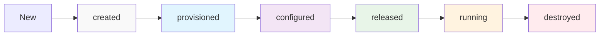

# Deployment Lifecycle & Command Overview

> **🎯 Quick Reference**  
> Overview of the Torrust Tracker Deployer lifecycle, states, and command relationships.

## Deployment States



| State         | Description                      | What Exists                              |
| ------------- | -------------------------------- | ---------------------------------------- |
| `created`     | Environment configuration exists | Config files, directories                |
| `provisioned` | Infrastructure is running        | VM/container, networking                 |
| `configured`  | System setup complete            | Docker, SSH, basic tools                 |
| `released`    | Application deployed             | Tracker files, Docker Compose config     |
| `running`     | Services are active              | Running containers, accessible endpoints |
| `destroyed`   | Resources cleaned up             | Nothing (temporary files may remain)     |

## Command State Transitions

| Command     | From State    | To State      | Current Status           |
| ----------- | ------------- | ------------- | ------------------------ |
| `create`    | -             | `created`     | ❌ Not implemented       |
| `provision` | `created`     | `provisioned` | ✅ E2E only              |
| `configure` | `provisioned` | `configured`  | 🔄 Partial (Docker only) |
| `release`   | `configured`  | `released`    | ❌ Not implemented       |
| `run`       | `released`    | `running`     | ❌ Not implemented       |
| `destroy`   | Any           | `destroyed`   | ✅ E2E only              |
| `status`    | Any           | No change     | ❌ Not implemented       |
| `test`      | Any           | No change     | ❌ Not implemented       |
| `check`     | Any           | No change     | ❌ Not implemented       |

## Quick Command Reference

### Core Workflow Commands

```bash
# Basic deployment workflow
torrust-tracker-deployer create myenv      # Initialize environment
torrust-tracker-deployer provision myenv   # Create infrastructure
torrust-tracker-deployer configure myenv   # Setup system
torrust-tracker-deployer release myenv     # Deploy application
torrust-tracker-deployer run myenv         # Start services

# Management commands
torrust-tracker-deployer status myenv      # Check environment
torrust-tracker-deployer test myenv        # Run validation
torrust-tracker-deployer destroy myenv     # Cleanup everything
```

### Utility Commands

```bash
torrust-tracker-deployer check            # Validate tools installation
torrust-tracker-deployer list             # List all environments
```

## What Works Today (E2E Tests)

```bash
# Simulate current working functionality through E2E tests
cargo run --bin e2e-tests-full

# This runs equivalent to:
# provision: Creates LXD container with OpenTofu
# configure: Installs Docker + Docker Compose
# validate: Tests Docker installation
# destroy: Cleans up container
```

## Implementation Status Summary

### ✅ Working (E2E Tests)

- Infrastructure provisioning (LXD containers)
- Basic system configuration (Docker installation)
- Template rendering (OpenTofu + Ansible)
- Resource cleanup and validation

### 🔄 Partially Working

- System configuration (missing firewall, monitoring)
- Error handling (basic but needs improvement)

### ❌ Not Implemented

- Multi-environment support
- Application deployment (Torrust Tracker)
- Service management and monitoring
- Production CLI interface
- State persistence between commands

## Next Steps for Development

1. **Extract E2E logic** to production command handlers
2. **Add CLI framework** with proper subcommand structure
3. **Implement state management** for command sequencing
4. **Add Torrust Tracker templates** for application deployment
5. **Build service management** for running applications

## Related Documentation

- [Console Commands](console-commands.md) - Detailed command specifications
- [Current Implementation](current-implementation.md) - Technical analysis of E2E tests
- [E2E Testing](../e2e-testing.md) - How to run and debug E2E tests
