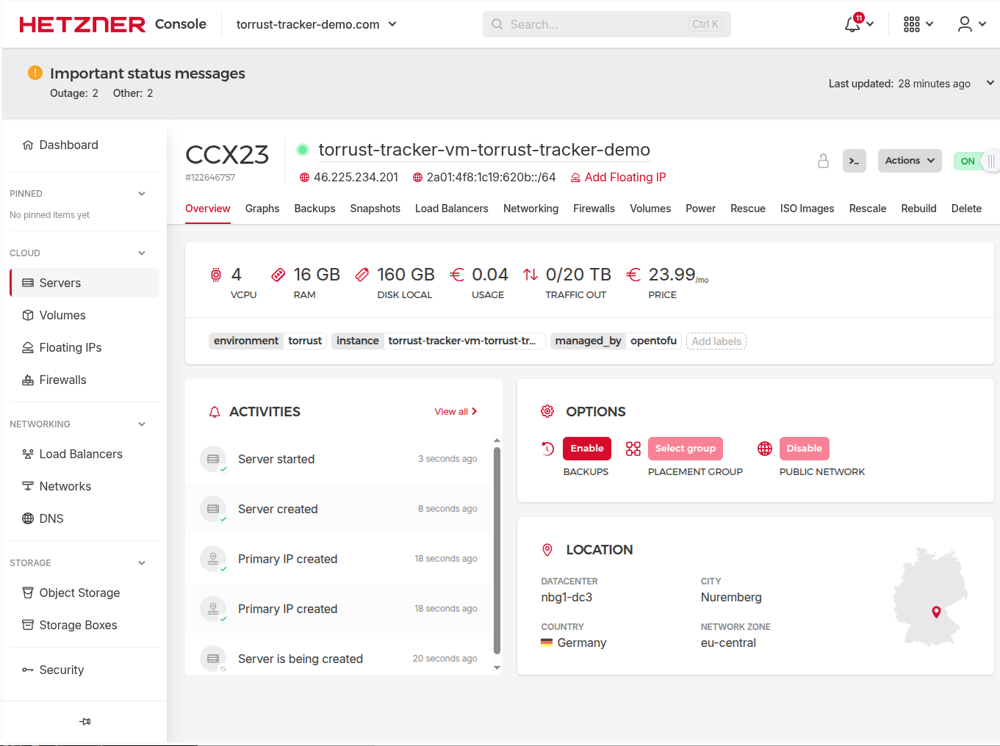

# Command: provision

> **Status**: ✅ Provisioned successfully (attempt 4, 2026-03-03 ~19:01 UTC).
> See [problems.md](problems.md) for the full failure history and root cause analysis.
> See [improvements.md](improvements.md) for deployer improvements applied during this process.
> See [cleanup-between-attempts.md](cleanup-between-attempts.md) for the cleanup procedure used between attempts.

## What `provision` does

The `provision` command:

1. Renders OpenTofu templates (Terraform HCL + cloud-init YAML) into `build/<env>/tofu/hetzner/`.
2. Runs `tofu init` + `tofu apply` to create the Hetzner server.
3. Waits for SSH connectivity (up to 300 seconds, 60 × 5 s intervals).
4. Marks the environment as `Provisioned` once SSH responds.

It does **not** install Docker, configure the tracker, or deploy any software — that is done by
the `configure`, `release`, and `run` commands.

## Command

```bash
docker run --rm \
  -v $(pwd)/data:/var/lib/torrust/deployer/data \
  -v $(pwd)/build:/var/lib/torrust/deployer/build \
  -v $(pwd)/envs:/var/lib/torrust/deployer/envs \
  -v ~/.ssh:/home/deployer/.ssh:ro \
  torrust/tracker-deployer:latest \
  provision torrust-tracker-demo
```

## Provisioned Server Details

The Hetzner server was created successfully by OpenTofu on 2026-03-03 at ~19:00 UTC (attempt 4).

| Property     | Value                                     |
| ------------ | ----------------------------------------- |
| Server name  | `torrust-tracker-vm-torrust-tracker-demo` |
| IPv4         | `46.225.234.201`                          |
| IPv6         | `2a01:4f8:1c19:620b::/64`                 |
| IPv6 address | `2a01:4f8:1c19:620b::1`                   |
| Location     | `nbg1` (Nuremberg, Germany)               |
| Server type  | `ccx23` (4 vCPU, 16 GB RAM)               |
| Image        | `ubuntu-24.04`                            |
| SSH user     | `torrust`                                 |

> **Note**: These are the server's own IPs assigned by Hetzner. The floating IPs
> (`116.202.176.169` IPv4, `2a01:4f8:1c0c:9aae::/64` IPv6) are separate and must be
> assigned to this server manually in the Hetzner Console after successful provisioning.
>
> **Note**: The `provision` command output currently only reports the IPv4 address. The IPv6
> address and network must be looked up in the Hetzner console or `terraform.tfstate`. See
> [improvements.md](improvements.md) for the tracked improvement.


> **Note**: The Hetzner activity log shows "Server is being created" as the last event even
> after the server is fully created and accessible. Hetzner does not emit a matching
> "Server creation finished" event, so this entry can be misleading. See
> [problems.md](problems.md) for full context.

For reference, the first server created in attempt 1:



## Generated Artifacts

After provisioning the following build artifacts are created:

- `build/torrust-tracker-demo/tofu/hetzner/` — rendered OpenTofu project (HCL + cloud-init)
- `build/torrust-tracker-demo/tofu/hetzner/cloud-init.yml` — cloud-init config with SSH key
- `data/torrust-tracker-demo/environment.json` — state updated to `Provisioned` (or
  `ProvisionFailed` if something went wrong)
- `data/torrust-tracker-demo/traces/` — failure trace files (generated automatically on error)

## Verifying the SSH Key Injection

The rendered `build/torrust-tracker-demo/tofu/hetzner/cloud-init.yml` should contain the
public SSH key in the `ssh_authorized_keys` section:

```yaml
users:
  - name: torrust
    groups: sudo
    shell: /bin/bash
    sudo: ["ALL=(ALL) NOPASSWD:ALL"]
    ssh_authorized_keys:
      - ssh-ed25519 <KEY> torrust-tracker-deployer
```

To verify the key matches your local public key:

```bash
grep -A1 "ssh_authorized_keys" build/torrust-tracker-demo/tofu/hetzner/cloud-init.yml
cat ~/.ssh/torrust_tracker_deployer_ed25519.pub
```

## Successful Provision Output (Attempt 4)

Final output of the `provision` command on attempt 4 (2026-03-03 ~19:01 UTC, 50.9 seconds):

```text
⏳ [1/3] Validating environment...
⏳   ✓ Environment name validated: torrust-tracker-demo (took 0ms)
⏳ [2/3] Creating command handler...
⏳   ✓ Done (took 0ms)
⏳ [3/3] Provisioning infrastructure...
⏳   ✓ Infrastructure provisioned (took 50.9s)
✅ Environment 'torrust-tracker-demo' provisioned successfully

{
  "environment_name": "torrust-tracker-demo",
  "instance_name": "torrust-tracker-vm-torrust-tracker-demo",
  "instance_ip": "46.225.234.201",
  "ssh_username": "torrust",
  "ssh_port": 22,
  "ssh_private_key_path": "/home/deployer/.ssh/torrust_tracker_deployer_ed25519",
  "provider": "hetzner",
  "provisioned_at": "2026-03-03T19:00:42.481676821Z",
  "domains": [
    "http1.torrust-tracker-demo.com",
    "http2.torrust-tracker-demo.com",
    "api.torrust-tracker-demo.com",
    "grafana.torrust-tracker-demo.com"
  ]
}
```

> **Note**: The output includes `instance_ip` (IPv4 only). The IPv6 address
> (`2a01:4f8:1c19:620b::1`) and network (`2a01:4f8:1c19:620b::/64`) are not included. See
> [improvements.md](improvements.md) for the tracked improvement.

## Key Learnings

After four attempts, the following were identified as the root causes of all failures:

1. **SSH key paths must be container-internal paths** — paths in `envs/*.json` must reflect
   paths inside the Docker container (`/home/deployer/.ssh/...`), not host paths.

2. **The deployment SSH key must not have a passphrase** — when running inside Docker there is
   no SSH agent and no TTY, so a passphrase-protected key cannot be used for authentication
   even if the key file is readable. This was the root cause of all three `Permission denied`
   failures in attempts 2, 3, and 4. See [problems.md](problems.md) for full analysis.

3. **Cloud-init on Hetzner `ccx23` can take 15+ minutes** — the SSH probe budget must account
   for this. In attempt 4 the server was ready well within the 300-second window (50.9s total
   including `tofu apply`), so this was not an issue once the passphrase was removed. But in
   the earlier attempts where the server lingered in "Server is being created" for 15+ minutes
   in the Hetzner console, a longer timeout would still not have helped because the fundamental
   auth problem was the passphrase.

## Manual SSH Verification (After Provisioning)

Once the server is up, verify SSH access directly from the host:

```bash
ssh -i ~/.ssh/torrust_tracker_deployer_ed25519 torrust@<SERVER_IP> "whoami && cloud-init status"
```

Expected output:

```text
torrust
status: done
```
