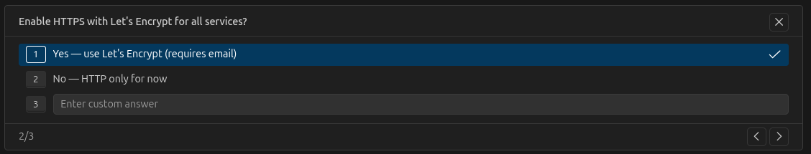
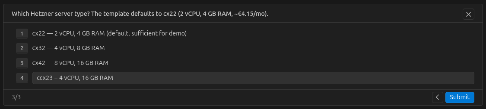
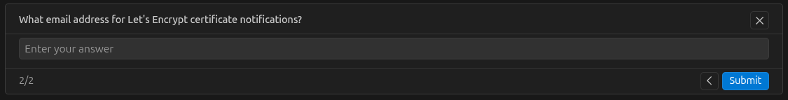
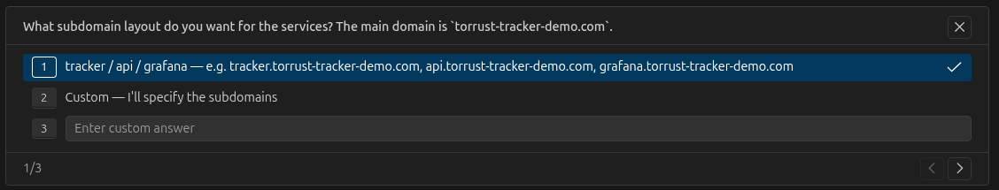

# Deployment Specification

Decisions and desired end-state for the demo tracker at `torrust-tracker-demo.com`.

> **Note**: This document describes _what_ we want to deploy. For step-by-step command
> documentation see the per-command sub-directories under `commands/` (`commands/create/`,
> `commands/provision/`, etc.).
>
> All secrets, API tokens, and passwords shown here are placeholders. Never commit real
> credentials.

## Configuration Decisions

| Decision          | Choice                                     | Rationale                                                                                  |
| ----------------- | ------------------------------------------ | ------------------------------------------------------------------------------------------ |
| Deployment method | Docker (`torrust/tracker-deployer:latest`) | Reproducible, no local dependency management; Docker is the recommended approach           |
| Server type       | `ccx23` — 4 vCPU, 16 GB RAM                | Sufficient headroom for a demo with full monitoring stack (tracker + Prometheus + Grafana) |
| Location          | `nbg1` (Nuremberg, Germany)                | Close to our development machines; matches the floating IP location                        |
| OS image          | `ubuntu-24.04`                             | LTS release, well-tested with Ansible playbooks                                            |
| Database          | MySQL                                      | Production-ready; better suited for a public demo with real traffic                        |
| HTTPS             | Yes — Let's Encrypt (`use_staging: false`) | Production certificates via Caddy reverse proxy; domain is fully registered                |
| Backup            | Daily at 03:00 UTC, 7-day retention        | Good default for a demo; protects against accidental data loss                             |

## Service Endpoints

| Service          | URL / Address                                       |
| ---------------- | --------------------------------------------------- |
| HTTP Tracker 1   | `https://http1.torrust-tracker-demo.com/announce`   |
| HTTP Tracker 2   | `https://http2.torrust-tracker-demo.com/announce`   |
| UDP Tracker 1    | `udp://udp1.torrust-tracker-demo.com:6969/announce` |
| UDP Tracker 2    | `udp://udp2.torrust-tracker-demo.com:6868/announce` |
| REST API         | `https://api.torrust-tracker-demo.com`              |
| Grafana          | `https://grafana.torrust-tracker-demo.com`          |
| Health Check API | `127.0.0.1:1313` (internal only)                    |

## How Decisions Were Made

Configuration decisions were made interactively with an AI coding agent (GitHub Copilot). The
agent asked targeted questions before generating the config file. The screenshots below capture
those questions and our answers.

**Should HTTPS with Let's Encrypt be enabled?**



Answer: Yes — production certificates via Caddy.

**Which Hetzner server type?**



Answer: Custom entry `ccx23` — 4 vCPU, 16 GB RAM.

**What email for Let's Encrypt certificate notifications?**



Answer: `jose.celano@nautilus-cyberneering.dev`

**What subdomains for each service?**



Answer:

- HTTP Tracker 1: `https://http1.torrust-tracker-demo.com/announce`
- HTTP Tracker 2: `https://http2.torrust-tracker-demo.com/announce`
- UDP Tracker 1: `udp://udp1.torrust-tracker-demo.com:6969/announce`
- UDP Tracker 2: `udp://udp2.torrust-tracker-demo.com:6868/announce`
- REST API: `https://api.torrust-tracker-demo.com`
- Grafana: `https://grafana.torrust-tracker-demo.com`

> **Note**: The agent also silently used SQLite by default. We caught this and switched to MySQL.
> The bind addresses were also defaulted to `0.0.0.0` (IPv4 only) — we changed them to `[::]` for
> dual-stack. Both issues are documented in [commands/create/problems.md](commands/create/problems.md).

## Environment Configuration File (sanitized)

The file is stored at `envs/torrust-tracker-demo.json` (git-ignored — contains the real API token).

```json
{
  "environment": {
    "name": "torrust-tracker-demo",
    "description": "Torrust Tracker demo instance at torrust-tracker-demo.com"
  },
  "ssh_credentials": {
    "private_key_path": "/home/deployer/.ssh/torrust_tracker_deployer_ed25519",
    "public_key_path": "/home/deployer/.ssh/torrust_tracker_deployer_ed25519.pub",
    "username": "torrust",
    "port": 22
  },
  "provider": {
    "provider": "hetzner",
    "api_token": "<HETZNER_API_TOKEN>",
    "server_type": "ccx23",
    "location": "nbg1",
    "image": "ubuntu-24.04"
  },
  "tracker": {
    "core": {
      "database": {
        "driver": "mysql",
        "host": "mysql",
        "port": 3306,
        "database_name": "torrust",
        "username": "root",
        "password": "<MYSQL_ROOT_PASSWORD>"
      },
      "private": false
    },
    "udp_trackers": [
      {
        "bind_address": "[::]:6969",
        "domain": "udp1.torrust-tracker-demo.com"
      },
      { "bind_address": "[::]:6868", "domain": "udp2.torrust-tracker-demo.com" }
    ],
    "http_trackers": [
      {
        "bind_address": "[::]:7070",
        "domain": "http1.torrust-tracker-demo.com",
        "use_tls_proxy": true
      },
      {
        "bind_address": "[::]:7071",
        "domain": "http2.torrust-tracker-demo.com",
        "use_tls_proxy": true
      }
    ],
    "http_api": {
      "bind_address": "[::]:1212",
      "admin_token": "<ADMIN_API_TOKEN>",
      "domain": "api.torrust-tracker-demo.com",
      "use_tls_proxy": true
    },
    "health_check_api": {
      "bind_address": "127.0.0.1:1313"
    }
  },
  "prometheus": {
    "scrape_interval_in_secs": 15
  },
  "grafana": {
    "admin_user": "admin",
    "admin_password": "<GRAFANA_ADMIN_PASSWORD>",
    "domain": "grafana.torrust-tracker-demo.com",
    "use_tls_proxy": true
  },
  "https": {
    "admin_email": "<ADMIN_EMAIL>",
    "use_staging": false
  },
  "backup": {
    "schedule": "0 3 * * *",
    "retention_days": 7
  }
}
```

## Related Documentation

- [Hetzner server types and pricing](../../user-guide/providers/hetzner/#available-server-types)
- [HTTPS/TLS configuration](../../user-guide/services/https.md)
- [Grafana service](../../user-guide/services/grafana.md)
- [Prometheus service](../../user-guide/services/prometheus.md)
