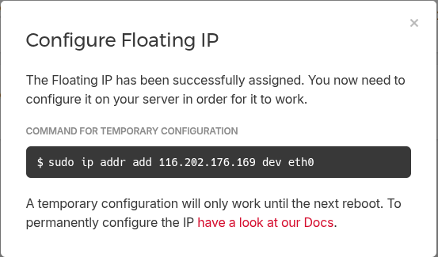
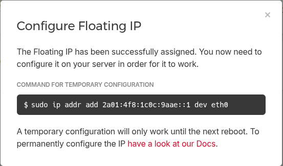
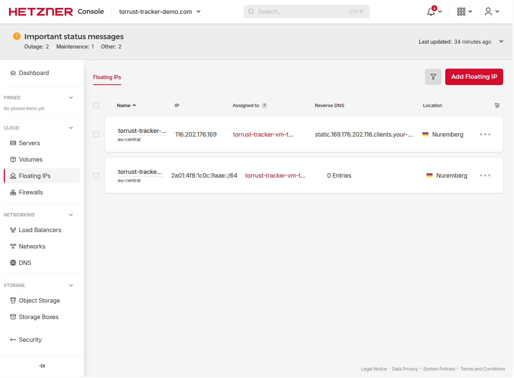

# DNS Setup

> **Status**: ✅ Done — floating IPs assigned and configured on VM; all 12 DNS records created and verified.

Set up DNS records so that all domain names in the environment config resolve to
the floating IP before running `configure`.

## Why Floating IPs?

The deployment uses **Hetzner floating IPs** (static IPs that can be reassigned across servers)
rather than the server's direct IP (`46.225.234.201`). This means:

- DNS records always point to the same IP, even if the underlying server is ever recreated.
- To rebuild the server, you reassign the floating IP — no DNS changes needed.

## Floating IPs

| Type | IP                      | Notes                                                                                |
| ---- | ----------------------- | ------------------------------------------------------------------------------------ |
| IPv4 | `116.202.176.169`       | Assign as A records                                                                  |
| IPv6 | `2a01:4f8:1c0c:9aae::1` | First usable address from `/64` block `2a01:4f8:1c0c:9aae::/64`; use as AAAA records |

## Step 1: Assign Floating IPs to the Server

In the [Hetzner Console](https://console.hetzner.cloud/):

1. Open the project `torrust-tracker-demo.com`.
2. Go to **Networking → Floating IPs**.
3. For the IPv4 floating IP (`116.202.176.169`):
   - Click **⋯ → Assign**.
   - Select server `torrust-tracker-vm-torrust-tracker-demo`.
   - Confirm.
4. For the IPv6 floating IP (`2a01:4f8:1c0c:9aae::/64`):
   - Same procedure — assign to the same server.

### IPv4 Assigned (2026-03-04)

The IPv4 floating IP was assigned successfully. Hetzner showed a confirmation popup:



The popup text:

> **Configure Floating IP**
>
> The Floating IP has been successfully assigned. You now need to configure it on
> your server in order for it to work.
>
> **Command for temporary configuration**
>
> `sudo ip addr add 116.202.176.169 dev eth0`
>
> A temporary configuration will only work until the next reboot. To permanently
> configure the IP have a look at our Docs.

### IPv6 Assigned (2026-03-04)

The IPv6 floating IP was assigned successfully. Hetzner showed a confirmation popup:



The popup text:

> **Configure Floating IP**
>
> The Floating IP has been successfully assigned. You now need to configure it on
> your server in order for it to work.
>
> **Command for temporary configuration**
>
> `sudo ip addr add 2a01:4f8:1c0c:9aae::1 dev eth0`
>
> A temporary configuration will only work until the next reboot. To permanently
> configure the IP have a look at our Docs.

### Both Floating IPs Assigned

Both IPs now appear in the Hetzner console Floating IPs list assigned to the server:



### Step 1.5: Configure the Floating IPs Inside the VM (2026-03-04)

Hetzner's assignment only updates their routing — the VM's network interface still needs to
know about the new IPs. The Hetzner console popup shows a **temporary** command that works
until the next reboot. We need the **permanent** configuration instead.

Reference: [Hetzner — Persistent Floating IP Configuration](https://docs.hetzner.com/cloud/floating-ips/persistent-configuration/)

**Temporary (shown by Hetzner popup — lost on reboot):**

```bash
sudo ip addr add 116.202.176.169 dev eth0
sudo ip addr add 2a01:4f8:1c0c:9aae::1 dev eth0
```

**Permanent (survives reboot) — what we did:**

First, we checked the current state of eth0 to confirm the floating IPs were not yet
configured on the VM:

```bash
ssh -i ~/.ssh/torrust_tracker_deployer_ed25519 -o StrictHostKeyChecking=accept-new torrust@46.225.234.201 'ip addr show eth0'
```

Output:

```text
2: eth0: <BROADCAST,MULTICAST,UP,LOWER_UP> mtu 1500 qdisc fq_codel state UP group default qlen 1000
    link/ether 92:00:07:4f:b3:4f brd ff:ff:ff:ff:ff:ff
    inet 46.225.234.201/32 metric 100 scope global dynamic eth0
       valid_lft 71163sec preferred_lft 71163sec
    inet6 2a01:4f8:1c19:620b::1/64 scope global
       valid_lft forever preferred_lft forever
    inet6 fe80::9000:7ff:fe4f:b34f/64 scope link
       valid_lft forever preferred_lft forever
```

Only the server's own IPs are present — no floating IPs yet.

> **Note**: We got a `WARNING: REMOTE HOST IDENTIFICATION HAS CHANGED` error because this
> is a new server with the same IP as a previously provisioned server (from an earlier attempt).
> Fixed by removing the stale known_hosts entry:
>
> ```bash
> ssh-keygen -f '/home/josecelano/.ssh/known_hosts' -R '46.225.234.201'
> ```

Wrote the netplan config file on the server:

```bash
ssh -i ~/.ssh/torrust_tracker_deployer_ed25519 torrust@46.225.234.201 \
  'printf "network:\n  version: 2\n  renderer: networkd\n  ethernets:\n    eth0:\n      addresses:\n        - 116.202.176.169/32\n        - 2a01:4f8:1c0c:9aae::1/64\n" | sudo tee /etc/netplan/60-floating-ip.yaml'
```

Fixed file permissions (netplan requires `600`) and applied:

```bash
ssh -i ~/.ssh/torrust_tracker_deployer_ed25519 torrust@46.225.234.201 \
  'sudo chmod 600 /etc/netplan/60-floating-ip.yaml && sudo netplan apply'
```

Verified both floating IPs are now on eth0:

```bash
ssh -i ~/.ssh/torrust_tracker_deployer_ed25519 torrust@46.225.234.201 'ip addr show eth0'
```

Output:

```text
2: eth0: <BROADCAST,MULTICAST,UP,LOWER_UP> mtu 1500 qdisc fq_codel state UP group default qlen 1000
    link/ether 92:00:07:4f:b3:4f brd ff:ff:ff:ff:ff:ff
    inet 116.202.176.169/32 scope global eth0
       valid_lft forever preferred_lft forever
    inet 46.225.234.201/32 metric 100 scope global dynamic eth0
       valid_lft 86399sec preferred_lft 86399sec
    inet6 2a01:4f8:1c0c:9aae::1/64 scope global
       valid_lft forever preferred_lft forever
    inet6 2a01:4f8:1c19:620b::1/64 scope global
       valid_lft forever preferred_lft forever
    inet6 fe80::9000:7ff:fe4f:b34f/64 scope link
       valid_lft forever preferred_lft forever
```

Both `116.202.176.169/32` and `2a01:4f8:1c0c:9aae::1/64` are present — `valid_lft forever`
confirms they are permanently configured.

> **Note**: The `configure` command does not configure floating IPs — this must be done
> manually before running `configure`.

## Step 2: Create DNS Records (2026-03-04)

The DNS zone `torrust-tracker-demo.com` was created in the **Hetzner Cloud Console**
(new system, [console.hetzner.cloud](https://console.hetzner.cloud/)). Hetzner is
[migrating DNS management](https://docs.hetzner.com/networking/dns/migration-to-hetzner-console/process/)
from the old [dns.hetzner.com](https://dns.hetzner.com) to the Cloud Console. Zones created
in the Cloud Console are only accessible via the **Hetzner Cloud API** — the old DNS API at
`dns.hetzner.com/api/v1` cannot see them.

> **Note**: If you create a DNS API token at `dns.hetzner.com`, it will return empty results
> (`"zones": []`) for zones created in the Cloud Console. Use the **Cloud API token** instead
> (from **Security → API Tokens** in the Cloud Console project).

### Records to Create

| Subdomain | Type | Value                   | Notes                           |
| --------- | ---- | ----------------------- | ------------------------------- |
| `http1`   | A    | `116.202.176.169`       |                                 |
| `http1`   | AAAA | `2a01:4f8:1c0c:9aae::1` |                                 |
| `http2`   | A    | `116.202.176.169`       |                                 |
| `http2`   | AAAA | `2a01:4f8:1c0c:9aae::1` |                                 |
| `api`     | A    | `116.202.176.169`       |                                 |
| `api`     | AAAA | `2a01:4f8:1c0c:9aae::1` |                                 |
| `grafana` | A    | `116.202.176.169`       |                                 |
| `grafana` | AAAA | `2a01:4f8:1c0c:9aae::1` |                                 |
| `udp1`    | A    | `116.202.177.184`       | Updated 2026-03-06 (issue #407) |
| `udp1`    | AAAA | `2a01:4f8:1c0c:828e::1` | Updated 2026-03-06 (issue #407) |
| `udp2`    | A    | `116.202.176.169`       |                                 |
| `udp2`    | AAAA | `2a01:4f8:1c0c:9aae::1` |                                 |

### API Approach

First, find the zone ID (or use the zone name directly):

```bash
curl -s -H "Authorization: Bearer $HCLOUD_TOKEN" \
  "https://api.hetzner.cloud/v1/zones"
```

Output showed zone `torrust-tracker-demo.com` with ID `944360`.

Create each record with `POST /v1/zones/{zone_name}/rrsets`:

```bash
HCLOUD_TOKEN="<Cloud-API-token-from-Security-API-Tokens>"
ZONE="torrust-tracker-demo.com"
IPV4="116.202.176.169"
IPV6="2a01:4f8:1c0c:9aae::1"

for sub in http1 http2 api grafana udp1 udp2; do
  # A record
  curl -s -X POST \
    -H "Authorization: Bearer $HCLOUD_TOKEN" \
    -H "Content-Type: application/json" \
    "https://api.hetzner.cloud/v1/zones/$ZONE/rrsets" \
    -d "{\"name\": \"$sub\", \"type\": \"A\", \"records\": [{\"value\": \"$IPV4\"}], \"ttl\": 300}"
  # AAAA record
  curl -s -X POST \
    -H "Authorization: Bearer $HCLOUD_TOKEN" \
    -H "Content-Type: application/json" \
    "https://api.hetzner.cloud/v1/zones/$ZONE/rrsets" \
    -d "{\"name\": \"$sub\", \"type\": \"AAAA\", \"records\": [{\"value\": \"$IPV6\"}], \"ttl\": 300}"
done
```

Each successful response contains an `rrset` object, for example:

```json
{
  "action": {
    "id": 615271254051174,
    "status": "running",
    "command": "create_rrset",
    ...
  },
  "rrset": {
    "id": "http1/A",
    "name": "http1",
    "type": "A",
    "ttl": 300,
    "records": [{"value": "116.202.176.169", "comment": ""}],
    "zone": 944360
  }
}
```

Verify all records were created:

```bash
curl -s -H "Authorization: Bearer $HCLOUD_TOKEN" \
  "https://api.hetzner.cloud/v1/zones/$ZONE/rrsets"
```

All 12 RRSets (6 × A + 6 × AAAA) plus the default NS and SOA were present.

## Step 3: Verify DNS Propagation (2026-03-04)

Verify against the authoritative nameservers first (no propagation delay):

```bash
for sub in http1 http2 api grafana udp1 udp2; do
  echo "=== $sub ==="
  dig +short A "$sub.torrust-tracker-demo.com" @hydrogen.ns.hetzner.com
  dig +short AAAA "$sub.torrust-tracker-demo.com" @hydrogen.ns.hetzner.com
done
```

Then verify global resolution (system resolver):

```bash
for sub in http1 http2 api grafana udp1 udp2; do
  A=$(dig +short A "$sub.torrust-tracker-demo.com")
  AAAA=$(dig +short AAAA "$sub.torrust-tracker-demo.com")
  echo "$sub: A=$A  AAAA=$AAAA"
done
```

Actual output (2026-03-04):

```text
http1: A=116.202.176.169  AAAA=2a01:4f8:1c0c:9aae::1
http2: A=116.202.176.169  AAAA=2a01:4f8:1c0c:9aae::1
api: A=116.202.176.169  AAAA=2a01:4f8:1c0c:9aae::1
grafana: A=116.202.176.169  AAAA=2a01:4f8:1c0c:9aae::1
udp1: A=116.202.176.169  AAAA=2a01:4f8:1c0c:9aae::1
udp2: A=116.202.176.169  AAAA=2a01:4f8:1c0c:9aae::1
```

## Step 4: Update DNS Records for UDP1 (2026-03-06)

As part of issue #407 (submitting the UDP1 tracker to newTrackon), the `udp1` A and AAAA records
were updated to point to the new dedicated floating IPs:

| Subdomain | Type | Old value               | New value               |
| --------- | ---- | ----------------------- | ----------------------- |
| `udp1`    | A    | `116.202.176.169`       | `116.202.177.184`       |
| `udp1`    | AAAA | `2a01:4f8:1c0c:9aae::1` | `2a01:4f8:1c0c:828e::1` |

Verified with `dig` (2026-03-06):

```text
$ dig A udp1.torrust-tracker-demo.com +short
116.202.177.184

$ dig AAAA udp1.torrust-tracker-demo.com +short
2a01:4f8:1c0c:828e::1
```

✅ `udp1.torrust-tracker-demo.com` now resolves exclusively to the UDP1 floating IPs.

✅ All 12 records resolve correctly globally.

> DNS propagation with Hetzner's nameservers (`helium.ns.hetzner.de`, `hydrogen.ns.hetzner.com`,
> `oxygen.ns.hetzner.com`) is typically fast (under 1 minute). If you get `NXDOMAIN` or empty
> results, wait a minute and retry.

## Outcome

✅ All subdomains resolve correctly. After the 2026-03-06 update, `udp1.torrust-tracker-demo.com`
resolves to the dedicated `udp1` floating IPs (`116.202.177.184` / `2a01:4f8:1c0c:828e::1`)
while all other subdomains continue to resolve to `116.202.176.169` (A) and
`2a01:4f8:1c0c:9aae::1` (AAAA). DNS setup is complete.
The next step is [volume-setup.md](volume-setup.md).

## Problems

### DNS API token from dns.hetzner.com does not see Cloud Console zones

**Symptom**: Creating a token at [dns.hetzner.com](https://dns.hetzner.com) and querying
`https://dns.hetzner.com/api/v1/zones` returns `{"zones": [], "error": {"message": "zone not found", "code": 404}}`.

**Cause**: Hetzner is migrating DNS management from the old `dns.hetzner.com` console to the
new Cloud Console ([console.hetzner.cloud](https://console.hetzner.cloud)). Zones **created in
the Cloud Console** live in the Cloud API only and are invisible to the old DNS API. See the
[migration docs](https://docs.hetzner.com/networking/dns/migration-to-hetzner-console/process/).

Additionally, the Cloud API does **not** have a `/v1/dns/zones` path —
`GET https://api.hetzner.cloud/v1/dns/zones` returns `{"error": {"code": "not_found", ...}}`.
The correct path is `/v1/zones`.

**Fix**: Use the Hetzner Cloud API token (from **Security → API Tokens** in the project) and
the `/v1/zones` endpoint:

```bash
curl -H "Authorization: Bearer $HCLOUD_TOKEN" https://api.hetzner.cloud/v1/zones
```

### SSH host key mismatch when connecting to the new server

**Symptom**: `WARNING: REMOTE HOST IDENTIFICATION HAS CHANGED` when SSHing to `46.225.234.201`.

**Cause**: A previous server was provisioned at the same IP during an earlier attempt (see
[provision/problems.md](../commands/provision/problems.md)). The old host key is still in
`~/.ssh/known_hosts`.

**Fix**:

```bash
ssh-keygen -f '~/.ssh/known_hosts' -R '46.225.234.201'
```

Then reconnect — SSH will accept and store the new host key.

### Netplan file permissions warning

**Symptom**: `WARNING: Permissions for /etc/netplan/60-floating-ip.yaml are too open` when
running `sudo netplan apply`.

**Cause**: Writing with `sudo tee` creates the file world-readable. Netplan requires `600`.

**Fix**: `sudo chmod 600 /etc/netplan/60-floating-ip.yaml` before or after `netplan apply`.

## Improvements

- The netplan file should be written with correct permissions from the start. Use
  `sudo install -m 600 /dev/stdin /etc/netplan/60-floating-ip.yaml` instead of `tee` to
  avoid the permissions warning.
