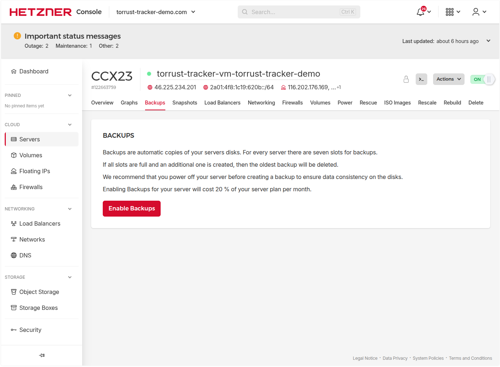
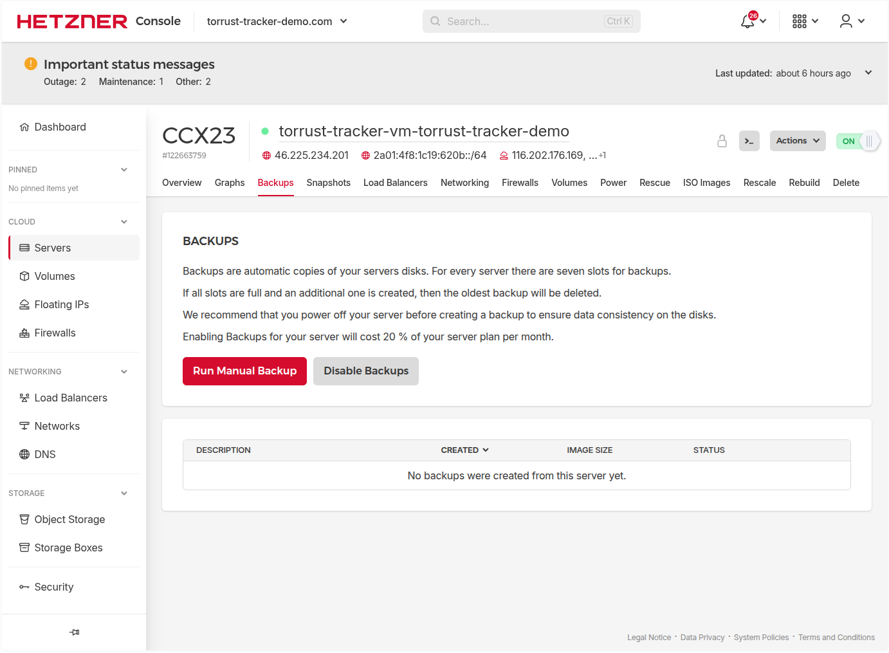

# Hetzner Backups Setup

> **Status**: ✅ Done — Hetzner automated backups enabled (2026-03-04).

Enable Hetzner's automated server backup feature so that a full server image is
taken once daily. This complements the application-level backup (MySQL dump +
config files) that runs inside the container.

> **This step can be done at any time** after provisioning — it does not depend
> on `configure`, `release`, or `run`.

## Why Hetzner Backups in Addition to the Application Backup?

The application-level backup (`backup` container + cron job) captures only the
application data stored on the Hetzner volume:

- MySQL database dumps (`mysql_*.sql.gz`)
- Config file archives (`config_*.tar.gz`)

It does **not** capture the OS, Docker installation, Caddy TLS certificates,
container images, or any data outside `/opt/torrust/storage/`.

Hetzner Backups capture the **entire server root disk** as a snapshot image.
This protects against catastrophic failures such as:

- OS corruption
- Accidental deletion of system files or Docker config
- Need to roll back to a known-good server state

| Layer           | What it covers                          | Storage location          |
| --------------- | --------------------------------------- | ------------------------- |
| App backup      | MySQL dump + config files               | Hetzner volume (internal) |
| Hetzner Backups | Full root disk (OS, Docker, everything) | Hetzner infrastructure    |

> **Note**: Hetzner Backups do **not** include attached volumes. The 50 GB
> storage volume (`torrust-tracker-demo-storage`) is not captured by this
> feature. Application-level backups remain essential for data recovery.

## Hetzner Backup Options

Hetzner offers two image-based backup mechanisms for servers:

| Feature       | Backups                               | Snapshots                            |
| ------------- | ------------------------------------- | ------------------------------------ |
| Trigger       | Automatic (daily, Hetzner picks time) | Manual or via API                    |
| Retention     | Last 7 kept automatically             | Kept until deleted manually          |
| Cost          | 20% of server price (~€0.76/mo)       | €0.0119/GB/month of compressed image |
| Configuration | Enable/disable toggle only            | Fully manual                         |
| Use case      | Ongoing safety net                    | Point-in-time capture before changes |

For this deployment we enable **Backups** (automated daily) as the ongoing
safety net. Snapshots can be taken manually before risky operations like
secrets rotation.

## Step 1: Enable Backups via the Hetzner Console (2026-03-04)

1. Open [Hetzner Cloud Console](https://console.hetzner.cloud/)
2. Navigate to **Projects → torrust-tracker-demo → Servers →
   torrust-tracker-demo**
3. Click the **Backups** tab
4. Click **Enable backups**

   The console presents a confirmation showing the cost: **+20% of server price**.

   

5. Confirm by clicking **Enable backups** in the dialog

Once enabled, the Backups tab immediately shows **Backups enabled** with an
empty list — no backups exist yet. The first backup will be taken automatically
during the next maintenance window (usually within 24 hours).

## What Happens After Enabling

- Hetzner takes one backup per day, automatically
- The last **7 backups** are retained; the oldest is deleted when a new one is
  created
- Each backup appears as a server image in **Images → Backups** in the console
- To restore: navigate to the server → **Backups** tab → select a backup →
  **Rebuild server from image** (this replaces the current root disk)

## Cost

| Resource        | Price               | Notes                        |
| --------------- | ------------------- | ---------------------------- |
| Hetzner Backups | 20% of server price | CX22 = ~€3.79/mo → ~€0.76/mo |
| Snapshots       | €0.0119/GB/month    | Only if taken manually       |
