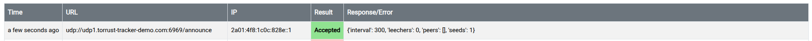

# IPv6 UDP Tracker — Known Issue

> **Status**: ✅ Resolved (2026-03-06) — two root causes identified and fixed:
>
> 1. `ufw` was blocking IPv6 UDP 6969 (primary blocker — packets never reached the container)
> 2. Asymmetric routing needed policy routing tables so replies leave via the correct floating IP
>
> ⚠️ Policy routing rules and ufw rule are in-memory / runtime only — needs persisting via netplan

## Context

During issue #407 (submitting the UDP1 tracker to newTrackon), the tracker was rejected with a
"UDP timeout" error. The newTrackon probe used the AAAA record
(`2a01:4f8:1c0c:828e::1`) to reach the tracker via IPv6. IPv4 probes (tested locally) work fine.

This document records the investigation, likely root cause, and the fix required.

## Symptom

- `udp://udp1.torrust-tracker-demo.com:6969/announce` submitted to newTrackon
- newTrackon probed via IPv6: `2a01:4f8:1c0c:828e::1`
- Result: ❌ **Rejected — UDP timeout**
- Local test via IPv4 (`116.202.177.184`): ✅ Works

## What Was Ruled Out

| Hypothesis                        | Evidence                                                                 | Verdict                    |
| --------------------------------- | ------------------------------------------------------------------------ | -------------------------- |
| Docker IPv6 disabled              | `ss -ulnp` shows `[::]:6969` — container binds to both IPv4 and IPv6     | ❌ Ruled out               |
| Wrong IP in DNS                   | `dig AAAA` returns `2a01:4f8:1c0c:828e::1` ✅                            | ❌ Ruled out               |
| Floating IP not on interface      | `ip addr show eth0` shows all four IPs with `valid_lft forever`          | ❌ Ruled out               |
| BEP 34 TXT record missing         | `dig TXT udp1.torrust-tracker-demo.com` returns correct value            | ❌ Ruled out               |
| Caddy proxy intercepting UDP      | UDP tracker bypasses reverse proxy entirely                              | ❌ Ruled out               |
| Asymmetric routing (reply source) | Without policy routing, replies left via primary IP, not the floating IP | ✅ Secondary issue — fixed |

## Investigation — 2026-03-06

### Check 1 — Verify Docker IPv6 Port Bindings

First hypothesis was Docker IPv6 disabled. Ran on the server:

```bash
sudo ss -ulnp | grep 6969
```

Output:

```text
UNCONN 0      0                  0.0.0.0:6969      0.0.0.0:*    users:(("docker-proxy",pid=1533796,fd=7))
UNCONN 0      0                     [::]:6969         [::]:*    users:(("docker-proxy",pid=1533806,fd=7))
```

✅ The tracker binds to **both** `0.0.0.0:6969` (IPv4) and `[::]:6969` (IPv6). Docker IPv6 is
enabled — packets arriving on the IPv6 floating IP do reach the container.

The issue is elsewhere: the packet arrives and the container processes it, but the **reply** goes
out via the wrong source IP.

### Check 2 — Verify IPv6 Policy Routing Rules

Policy-based routing forces replies to leave via the same floating IP the probe arrived on.
Checked whether the IPv6 rule was already in place:

```bash
ip -6 rule list
```

Output:

```text
0:      from all lookup local
32765:  from 2a01:4f8:1c0c:828e::1 lookup 200
32766:  from all lookup main
```

A rule was already present from a previous attempt. Verified the corresponding route table:

```bash
ip -6 route show table 200
```

Output:

```text
default via fe80::1 dev eth0
```

✅ IPv6 replies from `2a01:4f8:1c0c:828e::1` route via `fe80::1` (Hetzner's IPv6 gateway on
`eth0`).

### Check 3 — Add IPv4 Policy Routing Rules

The IPv4 floating IP (`116.202.177.184`) also needed symmetric routing. Found the IPv4 default
gateway:

```bash
ip route show default
```

Output:

```text
default via 172.31.1.1 dev eth0 proto dhcp src 46.225.234.201 metric 100
```

Added the IPv4 policy routing rules:

```bash
ip route add default via 172.31.1.1 dev eth0 table 100
ip rule add from 116.202.177.184 table 100
```

Verified:

```bash
ip rule list
```

Output:

```text
0:      from all lookup local
32765:  from 116.202.177.184 lookup 100
32766:  from all lookup main
32767:  from all lookup default
```

```bash
ip route show table 100
```

Output:

```text
default via 172.31.1.1 dev eth0
```

✅ IPv4 replies from `116.202.177.184` now route via `172.31.1.1` (Hetzner's IPv4 gateway).

### Check 4 — tcpdump During newTrackon Probe (Attempt 2)

After applying both policy routing rules, resubmitted to newTrackon. While the probe was
running, captured traffic on the server:

```bash
sudo tcpdump -i eth0 -n udp port 6969 -v
```

Output:

```text
tcpdump: listening on eth0, link-type EN10MB (Ethernet), snapshot length 262144 bytes
13:18:22.128306 IP6 (flowlabel 0xb28c9, hlim 56, next-header UDP (17) payload length: 24) 2a01:4f8:1c1a:715::1.37318 > 2a01:4f8:1c0c:828e::1.6969: [udp sum ok] UDP, length 16
13:18:32.129210 IP6 (flowlabel 0xdf835, hlim 56, next-header UDP (17) payload length: 24) 2a01:4f8:1c1a:715::1.34285 > 2a01:4f8:1c0c:828e::1.6969: [udp sum ok] UDP, length 16
```

**Key observation**: Only **incoming** packets appear (`2a01:4f8:1c1a:715::1` → `2a01:4f8:1c0c:828e::1`).
There are **no outgoing reply lines** from `2a01:4f8:1c0c:828e::1`. This means:

- ✅ Packets **arrive at eth0** — no Hetzner cloud firewall blocking upstream
- ❌ Packets are **silently dropped** before the container ever processes them
- The container logs showed zero hits on `:6969` — confirmed packets never reached docker-proxy

This rules out asymmetric routing as the primary cause: the issue is that packets don't reach the
container at all. Something between `eth0` ingress and Docker is dropping them.

### Check 5 — ufw Firewall Status

Inspected the ufw rules on the server:

```bash
sudo ufw status verbose
```

Output:

```text
Status: active
Logging: on (low)
Default: deny (incoming), allow (outgoing), deny (routed)
New profiles: skip

To                         Action      From
--                         ------      ----
22/tcp                     ALLOW IN    Anywhere                   # SSH access (configured port 22)
22/tcp (v6)                ALLOW IN    Anywhere (v6)              # SSH access (configured port 22)
```

❌ **`6969/udp` is absent from the allow list.**

`Default: deny (incoming)` means all inbound traffic not explicitly allowed is dropped.
while Docker bypasses the iptables `INPUT` chain for IPv4 published ports (writing its own DNAT
rules), it does **not** manage `ip6tables` by default. As a result:

- **IPv4 UDP 6969** — Docker DNAT bypasses ufw INPUT chain → works ✅
- **IPv6 UDP 6969** — No Docker ip6tables DNAT rule exists → hits ufw INPUT → `default: deny` → dropped

This explains why IPv4 tests always worked and IPv6 failed.

### Check 6 — iptables FORWARD Chain

Verified Docker's FORWARD rules were correctly in place for both IPv4 and IPv6:

```bash
sudo iptables -L FORWARD --line-numbers -n
sudo ip6tables -L FORWARD --line-numbers -n
```

Output:

```text
Chain FORWARD (policy DROP)
num  target          prot opt source      destination
1    DOCKER-USER     0    --  0.0.0.0/0   0.0.0.0/0
2    DOCKER-FORWARD  0    --  0.0.0.0/0   0.0.0.0/0
...

Chain FORWARD (policy DROP)
num  target          prot opt source  destination
1    DOCKER-USER     0    --  ::/0    ::/0
2    DOCKER-FORWARD  0    --  ::/0    ::/0
...
```

✅ `DOCKER-FORWARD` is present at position 2 for both IPv4 and IPv6. Once packets pass the INPUT
chain, forwarding to the container is handled correctly.

## Confirmed Root Causes

Two independent issues were both required to be fixed:

### Root Cause 1 — ufw Blocking IPv6 UDP 6969 (Primary)

The ufw firewall default policy is `deny (incoming)`. Port `6969/udp` was never added to the
allow list. For IPv6, Docker does not write `ip6tables` INPUT rules, so packets hit ufw's default
deny policy and are silently dropped before reaching docker-proxy.

For IPv4, Docker writes DNAT rules directly into `iptables` which bypass the ufw INPUT chain —
that is why IPv4 probes always worked.

```text
IPv6 path (broken):
  probe → eth0 → ip6tables INPUT chain → ufw default deny → dropped ❌

IPv4 path (always worked):
  probe → eth0 → iptables DNAT (Docker) → bypasses INPUT → container ✅
```

### Root Cause 2 — Asymmetric Routing (Secondary)

When a UDP probe arrives on a floating IP, the Linux kernel routes the reply using the **default
route** — which sends the packet out via the primary server IP (`2a01:4f8:1c19:620b::1` on IPv6,
`46.225.234.201` on IPv4). newTrackon discards the response because it comes from an unexpected
source address.

```text
Without policy routing:
  probe → arrives on floating IP → container processes → reply leaves via primary IP
  newTrackon sees reply from wrong source → discards → "UDP timeout"

With policy routing:
  probe → arrives on floating IP → container processes
  → kernel matches "from <floating IP>" rule → routes via table 100/200
  → reply leaves via correct floating IP → newTrackon accepts
```

## Historical Context

### Old Demo Tracker (torrust-demo.com, Digital Ocean)

The previous Torrust demo tracker was deployed on Digital Ocean with a reserved IPv4
(`144.126.245.19`). That deployment only served **IPv4** — no IPv6 floating IPs were configured.
This means the asymmetric routing / IPv6 Docker issue was never encountered.

### This Deployment (torrust-tracker-demo.com, Hetzner)

This is the **first Torrust deployment routing UDP tracker traffic over IPv6 floating IPs**.
The combination of:

1. Multiple floating IPs (both IPv4 and IPv6)
2. Docker with default network settings
3. UDP tracker on port 6969

…is new territory. Both ufw and asymmetric routing needed to be addressed (see above).

### Proxy Difference (Nginx vs Caddy)

The old demo used Nginx as a reverse proxy; this deployment uses Caddy. This is **irrelevant
for UDP tracker traffic** — UDP does not go through the reverse proxy (HTTP only). Both
setups are equivalent from the UDP tracker's perspective.

## Fix Applied (2026-03-06)

> ⚠️ All fixes below are **runtime only** (in-memory). They will be lost on reboot.
> See [Step 3 — Persist via Netplan](#step-3--persist-via-netplan--pending) below.

### Fix 1 — Open UDP 6969 in ufw ✅

This was the critical fix that allowed IPv6 UDP packets to reach the container.

```bash
sudo ufw allow 6969/udp
```

Verified:

```bash
sudo ufw status verbose
```

Output:

```text
Status: active
Logging: on (low)
Default: deny (incoming), allow (outgoing), deny (routed)
New profiles: skip

To                         Action      From
--                         ------      ----
22/tcp                     ALLOW IN    Anywhere                   # SSH access (configured port 22)
6969/udp                   ALLOW IN    Anywhere
22/tcp (v6)                ALLOW IN    Anywhere (v6)              # SSH access (configured port 22)
6969/udp (v6)              ALLOW IN    Anywhere (v6)
```

✅ Both IPv4 and IPv6 UDP port 6969 are now allowed in.

### Fix 2 — IPv6 Policy Routing Rule ✅

Already present from an earlier investigation step (see Check 2 above).

|       |                                            |
| ----- | ------------------------------------------ |
| Rule  | `from 2a01:4f8:1c0c:828e::1 lookup 200`    |
| Route | `default via fe80::1 dev eth0` (table 200) |

### Fix 3 — IPv4 Policy Routing Rule ✅

Added to ensure IPv4 replies also leave via the correct floating IP (see Check 3 above).

```bash
ip route add default via 172.31.1.1 dev eth0 table 100
ip rule add from 116.202.177.184 table 100
```

### Step 3 — Persist via Netplan (⬜ Pending)

All three runtime rules must be persisted so they survive a server reboot. Update
`/etc/netplan/60-floating-ip.yaml`:

```yaml
network:
  version: 2
  renderer: networkd
  ethernets:
    eth0:
      addresses:
        # Existing floating IPs (HTTP1 / http1.torrust-tracker-demo.com)
        - 116.202.176.169/32
        - 2a01:4f8:1c0c:9aae::1/64
        # New floating IPs (UDP1 / udp1.torrust-tracker-demo.com)
        - 116.202.177.184/32
        - 2a01:4f8:1c0c:828e::1/64
      routing-policy:
        - from: 116.202.177.184
          table: 100
        - from: 2a01:4f8:1c0c:828e::1
          table: 200
      routes:
        - to: default
          via: 172.31.1.1
          table: 100
        - to: default
          via: fe80::1
          table: 200
```

Apply and verify:

```bash
sudo netplan apply

# Verify IPv4
ip rule list
ip route show table 100

# Verify IPv6
ip -6 rule list
ip -6 route show table 200
```

For ufw, the rule added via `sudo ufw allow 6969/udp` is already persistent (ufw stores rules
in `/etc/ufw/`). It will survive a reboot — but verify with `sudo ufw status` after reboot.

> **Note**: The `routing-policy` and per-table `routes` keys in netplan require
> `renderer: networkd`. Confirm with: `systemctl status systemd-networkd`.

## Result

After applying both fixes (ufw + policy routing):

```text
URL:      udp://udp1.torrust-tracker-demo.com:6969/announce
IP:       2a01:4f8:1c0c:828e::1
Result:   ✅ Accepted
Response: {'interval': 300, 'leechers': 0, 'peers': [], 'seeds': 1}
```



## Impact

This issue **no longer blocks** the UDP1 tracker. All tracker functionality is operational:

- HTTP tracker — Caddy → Docker on IPv4 ✅
- IPv4 UDP tracker ✅
- IPv6 UDP tracker via floating IP `2a01:4f8:1c0c:828e::1` ✅
- HTTP1 and UDP1 trackers listed on newTrackon ✅

## Cross-Repository Note

This issue should also be documented in the
[torrust-tracker](https://github.com/torrust/torrust-tracker) repository, as it involves
the tracker's network configuration requirements when running with multiple IPv6 floating IPs.
Any future deployment guide covering IPv6 should mention:

1. Open firewall port for UDP tracker: `sudo ufw allow <port>/udp` — Docker does **not** manage
   `ip6tables` INPUT rules, so ufw's default deny blocks all IPv6 inbound unless explicitly allowed
2. Verify with `sudo ss -ulnp | grep <port>` that the tracker binds to both `0.0.0.0` and `[::]`
3. Policy-based routing is required for each floating IP to ensure replies leave via the correct
   source address (both IPv4 and IPv6)

## Related

- [Issue #407 — Submit UDP1 Tracker to newTrackon](../../../issues/407-submit-udp1-tracker-to-newtrackon.md)
- [newTrackon Prerequisites](newtrackon-prerequisites.md)
- [Netplan Configuration](newtrackon-prerequisites.md#step-3--configure-all-floating-ips-permanently-via-netplan-)
