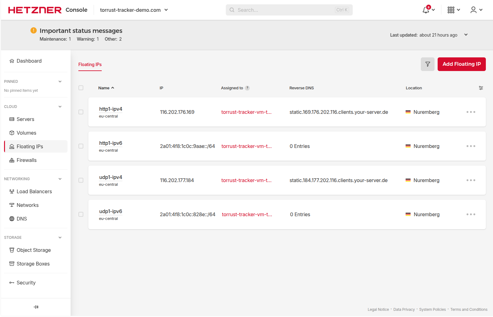

# newTrackon Prerequisites

> **Status**: 🔄 In Progress — HTTP1 tracker listed; UDP1 tracker submission pending resolution
> of BEP 34 DNS records and additional floating IPs.

This document captures the newTrackon prerequisites that were **not** addressed during the initial
tracker submission on 2026-03-04 and the steps being taken to fix them.

## Context

During the original deployment (issue #405), we attempted to submit both trackers to
[newTrackon](https://newtrackon.com/):

- `https://http1.torrust-tracker-demo.com/announce` — **✅ Accepted**
- `udp://udp1.torrust-tracker-demo.com:6969/announce` — **❌ Not accepted**

The HTTP1 tracker was listed successfully. The UDP1 tracker was not accepted because two
prerequisites were missed:

1. **BEP 34 DNS TXT records** were not set on the tracker domains.
2. **One tracker per IP policy**: The UDP1 subdomain resolves to the same IPs already used by
   HTTP1, violating newTrackon's uniqueness requirement.

## newTrackon Prerequisites

### Prerequisite 1 — BEP 34 DNS TXT Record

[BEP 34](https://www.bittorrent.org/beps/bep_0034.html) defines a DNS TXT record format that
announces which ports a domain is intentionally serving as a BitTorrent tracker. newTrackon uses
this record to validate submissions.

**Record format**: `"BITTORRENT UDP:<port> TCP:<port>"`

You only include the protocols that the tracker actually serves. Examples:

```text
# TCP (HTTP/WebSocket) tracker on port 443
"BITTORRENT TCP:443"

# UDP tracker on port 6969
"BITTORRENT UDP:6969"

# Both protocols on the same domain
"BITTORRENT UDP:6969 TCP:443"
```

**Reference deployment** — the old demo tracker (`tracker.torrust-demo.com`) has:

```text
dig TXT tracker.torrust-demo.com
;; ANSWER SECTION:
tracker.torrust-demo.com. 3600 IN TXT "BITTORRENT UDP:6969 TCP:443"
```

**Records required for this deployment**:

| Domain                           | TXT value             | Protocol served |
| -------------------------------- | --------------------- | --------------- |
| `http1.torrust-tracker-demo.com` | `BITTORRENT TCP:443`  | HTTP tracker    |
| `udp1.torrust-tracker-demo.com`  | `BITTORRENT UDP:6969` | UDP tracker     |

> **Note**: These TXT records were missing during the initial submission. The HTTP1 tracker was
> accepted without one, but the UDP1 tracker was not. Adding them for both subdomains ensures
> full compliance going forward.

### Prerequisite 2 — One Tracker Per IP Address

newTrackon enforces that each listed tracker resolves to at least one IP address that is **not**
already used by another tracker already in the list.

**Current situation**:

- `http1.torrust-tracker-demo.com` resolves to:
  - IPv4: `116.202.176.169`
  - IPv6: `2a01:4f8:1c0c:9aae::1`
- `udp1.torrust-tracker-demo.com` also resolves to the same two IPs (shared with HTTP1).

Because HTTP1 already occupies both IPs, the UDP1 submission is rejected.

**Solution**: Provision two new Hetzner floating IPs (one IPv4, one IPv6) and point
`udp1.torrust-tracker-demo.com` exclusively to them.

**New IPs provisioned (2026-03-06)**:

| Name        | Type | Address                 |
| ----------- | ---- | ----------------------- |
| `udp1-ipv4` | IPv4 | `116.202.177.184`       |
| `udp1-ipv6` | IPv6 | `2a01:4f8:1c0c:828e::1` |



## Fix Plan

### Step 1 — Add BEP 34 TXT Records via Hetzner DNS API

Add TXT records for both tracker subdomains using the Hetzner DNS API:

```bash
# HTTP1 — TCP tracker on port 443
curl -X POST "https://dns.hetzner.com/api/v1/records" \
  -H "Auth-API-Token: $HETZNER_DNS_TOKEN" \
  -H "Content-Type: application/json" \
  -d '{
    "zone_id": "<zone_id_for_torrust-tracker-demo.com>",
    "type": "TXT",
    "name": "http1",
    "value": "\"BITTORRENT TCP:443\"",
    "ttl": 3600
  }'

# UDP1 — UDP tracker on port 6969
curl -X POST "https://dns.hetzner.com/api/v1/records" \
  -H "Auth-API-Token: $HETZNER_DNS_TOKEN" \
  -H "Content-Type: application/json" \
  -d '{
    "zone_id": "<zone_id_for_torrust-tracker-demo.com>",
    "type": "TXT",
    "name": "udp1",
    "value": "\"BITTORRENT UDP:6969\"",
    "ttl": 3600
  }'
```

Verify with `dig`:

```bash
dig TXT http1.torrust-tracker-demo.com
dig TXT udp1.torrust-tracker-demo.com
```

### Step 2 — Provision New Floating IPs ✅ Done (2026-03-06)

In the [Hetzner Console](https://console.hetzner.cloud/) under the `torrust-tracker-demo.com`
project:

1. Go to **Networking → Floating IPs**.
2. Click **Add Floating IP**.
3. Select **Type: IPv4**, region **Nuremberg (nbg1)**, then create.
4. Repeat for **Type: IPv6**, same region.
5. Assign both new IPs to server `torrust-tracker-vm-torrust-tracker-demo`.

New IPs created and assigned:

| Name        | Type | Address                 |
| ----------- | ---- | ----------------------- |
| `udp1-ipv4` | IPv4 | `116.202.177.184`       |
| `udp1-ipv6` | IPv6 | `2a01:4f8:1c0c:828e::1` |

### Step 3 — Configure All Floating IPs Permanently via Netplan

The original floating IPs (`116.202.176.169` and `2a01:4f8:1c0c:9aae::1`) were configured
temporarily (using `ip addr add`) and were **not** persisted via netplan. This step fixes that
and adds the new IPs at the same time.

SSH into the server and create or replace `/etc/netplan/60-floating-ip.yaml`:

```yaml
network:
  version: 2
  ethernets:
    eth0:
      addresses:
        # Existing floating IPs (HTTP1 / http1.torrust-tracker-demo.com)
        - 116.202.176.169/32
        - 2a01:4f8:1c0c:9aae::1/128
        # New floating IPs (UDP1 / udp1.torrust-tracker-demo.com)
        - 116.202.177.184/32
        - 2a01:4f8:1c0c:828e::1/128
```

Apply and verify:

```bash
sudo netplan apply
ip addr show eth0
```

All four IPs should appear on the interface.

### Step 4 — Update DNS for UDP1 Subdomain

Update the A and AAAA records for `udp1.torrust-tracker-demo.com` to point to the new IPs:

```bash
# Get existing record IDs first
curl -s "https://dns.hetzner.com/api/v1/records?zone_id=<zone_id>" \
  -H "Auth-API-Token: $HETZNER_DNS_TOKEN" \
  | jq '.records[] | select(.name == "udp1")'

# Update A record
curl -X PUT "https://dns.hetzner.com/api/v1/records/<record_id_for_udp1_A>" \
  -H "Auth-API-Token: $HETZNER_DNS_TOKEN" \
  -H "Content-Type: application/json" \
  -d '{
    "zone_id": "<zone_id>",
    "type": "A",
    "name": "udp1",
    "value": "<new_ipv4>",
    "ttl": 3600
  }'

# Update AAAA record
curl -X PUT "https://dns.hetzner.com/api/v1/records/<record_id_for_udp1_AAAA>" \
  -H "Auth-API-Token: $HETZNER_DNS_TOKEN" \
  -H "Content-Type: application/json" \
  -d '{
    "zone_id": "<zone_id>",
    "type": "AAAA",
    "name": "udp1",
    "value": "<new_ipv6>",
    "ttl": 3600
  }'
```

Verify:

```bash
dig A udp1.torrust-tracker-demo.com
dig AAAA udp1.torrust-tracker-demo.com
```

### Step 5 — Submit UDP1 to newTrackon

1. Go to <https://newtrackon.com/>
2. Paste `udp://udp1.torrust-tracker-demo.com:6969/announce` into the submission box
3. Click **Submit**
4. Wait a few minutes while newTrackon probes the tracker
5. Verify acceptance and appearance in the [tracker list](https://newtrackon.com/list)

Verify via API:

```bash
curl -s https://newtrackon.com/api/stable | grep udp1.torrust-tracker-demo.com
```

## Status

| Item                                    | Status      | Date       |
| --------------------------------------- | ----------- | ---------- |
| BEP 34 TXT record for `http1`           | ⬜ Not done |            |
| BEP 34 TXT record for `udp1`            | ⬜ Not done |            |
| New IPv4 floating IP provisioned        | ✅ Done     | 2026-03-06 |
| New IPv6 floating IP provisioned        | ✅ Done     | 2026-03-06 |
| New IPs assigned to server              | ✅ Done     | 2026-03-06 |
| All floating IPs configured via netplan | ⬜ Not done |            |
| DNS A/AAAA records updated for `udp1`   | ⬜ Not done |            |
| UDP1 tracker submitted to newTrackon    | ⬜ Not done |            |
| UDP1 tracker listed on newTrackon       | ⬜ Not done |            |

## Related

- [Issue #407 — Submit UDP1 Tracker to newTrackon](../../../issues/407-submit-udp1-tracker-to-newtrackon.md)
- [BEP 34 — DNS Tracker Preferences](https://www.bittorrent.org/beps/bep_0034.html)
- [newTrackon](https://newtrackon.com/)
- [DNS Setup](dns-setup.md)
- [Tracker Registry](../tracker-registry.md)
