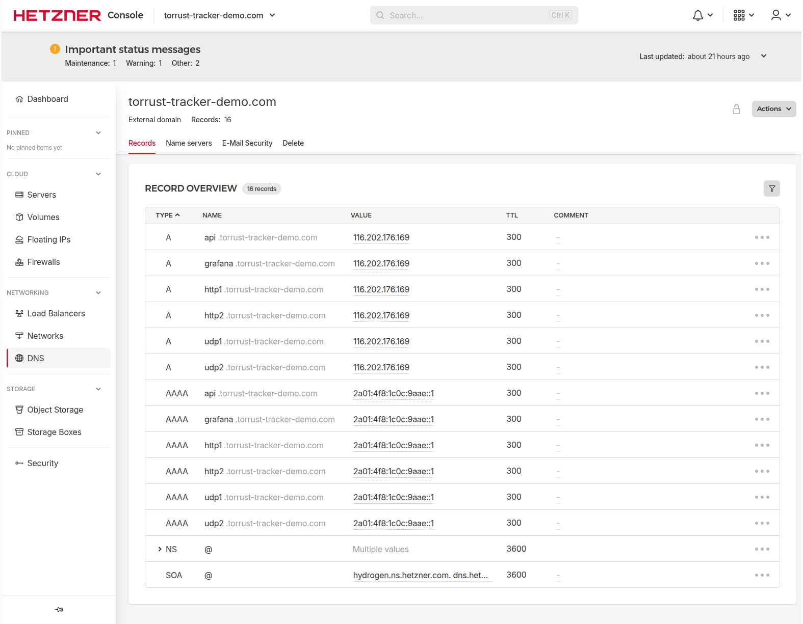
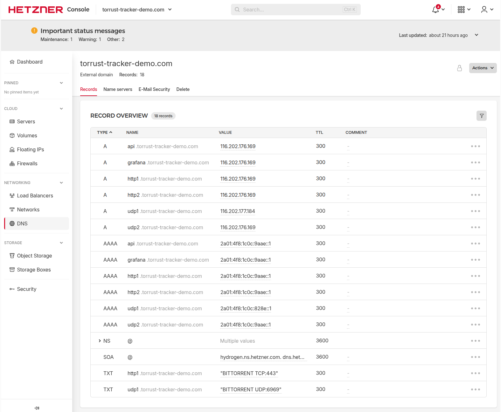
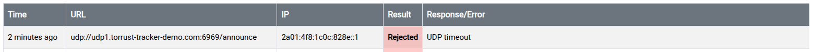

# newTrackon Prerequisites

> **Status**: 🔄 In Progress — HTTP1 tracker listed; UDP1 tracker submission pending resolution
> of BEP 34 DNS records and additional floating IPs.

This document captures the newTrackon prerequisites that were **not** addressed during the initial
tracker submission on 2026-03-04 and the steps being taken to fix them.

## Context

During the original deployment (issue #405), we attempted to submit both trackers to
[newTrackon](https://newtrackon.com/):

- `https://http1.torrust-tracker-demo.com/announce` — **✅ Accepted**
- `udp://udp1.torrust-tracker-demo.com:6969/announce` — **❌ Not accepted**

The HTTP1 tracker was listed successfully. The UDP1 tracker was not accepted because two
prerequisites were missed:

1. **BEP 34 DNS TXT records** were not set on the tracker domains.
2. **One tracker per IP policy**: The UDP1 subdomain resolves to the same IPs already used by
   HTTP1, violating newTrackon's uniqueness requirement.

## newTrackon Prerequisites

### Prerequisite 1 — BEP 34 DNS TXT Record

[BEP 34](https://www.bittorrent.org/beps/bep_0034.html) defines a DNS TXT record format that
announces which ports a domain is intentionally serving as a BitTorrent tracker. newTrackon uses
this record to validate submissions.

**Record format**: `"BITTORRENT UDP:<port> TCP:<port>"`

You only include the protocols that the tracker actually serves. Examples:

```text
# TCP (HTTP/WebSocket) tracker on port 443
"BITTORRENT TCP:443"

# UDP tracker on port 6969
"BITTORRENT UDP:6969"

# Both protocols on the same domain
"BITTORRENT UDP:6969 TCP:443"
```

**Reference deployment** — the old demo tracker (`tracker.torrust-demo.com`) has:

```text
dig TXT tracker.torrust-demo.com
;; ANSWER SECTION:
tracker.torrust-demo.com. 3600 IN TXT "BITTORRENT UDP:6969 TCP:443"
```

**Records required for this deployment**:

| Domain                           | TXT value             | Protocol served |
| -------------------------------- | --------------------- | --------------- |
| `http1.torrust-tracker-demo.com` | `BITTORRENT TCP:443`  | HTTP tracker    |
| `udp1.torrust-tracker-demo.com`  | `BITTORRENT UDP:6969` | UDP tracker     |

> **Note**: These TXT records were missing during the initial submission. The HTTP1 tracker was
> accepted without one, but the UDP1 tracker was not. Adding them for both subdomains ensures
> full compliance going forward.

### Prerequisite 2 — One Tracker Per IP Address

newTrackon enforces that each listed tracker resolves to at least one IP address that is **not**
already used by another tracker already in the list.

**Current situation**:

- `http1.torrust-tracker-demo.com` resolves to:
  - IPv4: `116.202.176.169`
  - IPv6: `2a01:4f8:1c0c:9aae::1`
- `udp1.torrust-tracker-demo.com` also resolves to the same two IPs (shared with HTTP1).

Because HTTP1 already occupies both IPs, the UDP1 submission is rejected.

**Solution**: Provision two new Hetzner floating IPs (one IPv4, one IPv6) and point
`udp1.torrust-tracker-demo.com` exclusively to them.

**New IPs provisioned (2026-03-06)**:

| Name        | Type | Address                 |
| ----------- | ---- | ----------------------- |
| `udp1-ipv4` | IPv4 | `116.202.177.184`       |
| `udp1-ipv6` | IPv6 | `2a01:4f8:1c0c:828e::1` |


## DNS State Before Changes (2026-03-06)

Recorded before making any DNS changes so we can verify the effect afterwards.

Screenshot of the Hetzner DNS panel:



`dig` output — all six subdomains resolve to the same two shared IPs, no TXT records exist:

```text
$ dig A {http1,http2,udp1,udp2,api,grafana}.torrust-tracker-demo.com +short
# All return: 116.202.176.169

$ dig AAAA {http1,http2,udp1,udp2,api,grafana}.torrust-tracker-demo.com +short
# All return: 2a01:4f8:1c0c:9aae::1

$ dig TXT {http1,http2,udp1,udp2}.torrust-tracker-demo.com +short
# (no output — no TXT records set)
```

Expected state after changes:

| Subdomain | A record          | AAAA record             | TXT record              |
| --------- | ----------------- | ----------------------- | ----------------------- |
| `http1`   | `116.202.176.169` | `2a01:4f8:1c0c:9aae::1` | `"BITTORRENT TCP:443"`  |
| `http2`   | `116.202.176.169` | `2a01:4f8:1c0c:9aae::1` | —                       |
| `udp1`    | `116.202.177.184` | `2a01:4f8:1c0c:828e::1` | `"BITTORRENT UDP:6969"` |
| `udp2`    | `116.202.176.169` | `2a01:4f8:1c0c:9aae::1` | —                       |
| `api`     | `116.202.176.169` | `2a01:4f8:1c0c:9aae::1` | —                       |
| `grafana` | `116.202.176.169` | `2a01:4f8:1c0c:9aae::1` | —                       |

## Fix Plan

### Step 1 — Add BEP 34 TXT Records via Hetzner DNS API ✅ Done (2026-03-06)

Added directly in the Hetzner DNS panel (TTL 300, consistent with all other records in the zone):

```text
http1  300  IN  TXT  "BITTORRENT TCP:443"
udp1   300  IN  TXT  "BITTORRENT UDP:6969"
```

Verified with `dig`:

```text
$ dig TXT http1.torrust-tracker-demo.com +short
"BITTORRENT TCP:443"

$ dig TXT udp1.torrust-tracker-demo.com +short
"BITTORRENT UDP:6969"
```

**Reference** — the same records can be added via the Hetzner DNS API:

Add TXT records for both tracker subdomains using the Hetzner DNS API:

```bash
# HTTP1 — TCP tracker on port 443
curl -X POST "https://dns.hetzner.com/api/v1/records" \
  -H "Auth-API-Token: $HETZNER_DNS_TOKEN" \
  -H "Content-Type: application/json" \
  -d '{
    "zone_id": "<zone_id_for_torrust-tracker-demo.com>",
    "type": "TXT",
    "name": "http1",
    "value": "\"BITTORRENT TCP:443\"",
    "ttl": 300
  }'

# UDP1 — UDP tracker on port 6969
curl -X POST "https://dns.hetzner.com/api/v1/records" \
  -H "Auth-API-Token: $HETZNER_DNS_TOKEN" \
  -H "Content-Type: application/json" \
  -d '{
    "zone_id": "<zone_id_for_torrust-tracker-demo.com>",
    "type": "TXT",
    "name": "udp1",
    "value": "\"BITTORRENT UDP:6969\"",
    "ttl": 300
  }'
```

Verify with `dig`:

```bash
dig TXT http1.torrust-tracker-demo.com
dig TXT udp1.torrust-tracker-demo.com
```

### Step 2 — Provision New Floating IPs ✅ Done (2026-03-06)

In the [Hetzner Console](https://console.hetzner.cloud/) under the `torrust-tracker-demo.com`
project:

1. Go to **Networking → Floating IPs**.
2. Click **Add Floating IP**.
3. Select **Type: IPv4**, region **Nuremberg (nbg1)**, then create.
4. Repeat for **Type: IPv6**, same region.
5. Assign both new IPs to server `torrust-tracker-vm-torrust-tracker-demo`.

New IPs created and assigned:

| Name        | Type | Address                 |
| ----------- | ---- | ----------------------- |
| `udp1-ipv4` | IPv4 | `116.202.177.184`       |
| `udp1-ipv6` | IPv6 | `2a01:4f8:1c0c:828e::1` |

### Step 3 — Configure All Floating IPs Permanently via Netplan ✅ Done (2026-03-06)

The original floating IPs (`116.202.176.169` and `2a01:4f8:1c0c:9aae::1`) were configured
temporarily (using `ip addr add`) and were **not** persisted via netplan. This step fixes that
and adds the new IPs at the same time.

SSH into the server and updated `/etc/netplan/60-floating-ip.yaml`:

```yaml
network:
  version: 2
  renderer: networkd
  ethernets:
    eth0:
      addresses:
        # Existing floating IPs (HTTP1 / http1.torrust-tracker-demo.com)
        - 116.202.176.169/32
        - 2a01:4f8:1c0c:9aae::1/64
        # New floating IPs (UDP1 / udp1.torrust-tracker-demo.com)
        - 116.202.177.184/32
        - 2a01:4f8:1c0c:828e::1/64
```

> **Note**: IPv6 floating IPs use `/64` prefix (consistent with the existing Hetzner convention),
> not `/128`.

Applied and verified:

```bash
sudo chmod 600 /etc/netplan/60-floating-ip.yaml
sudo netplan apply
ip addr show eth0
```

Actual output:

```text
2: eth0: <BROADCAST,MULTICAST,UP,LOWER_UP> mtu 1500 qdisc fq_codel state UP group default qlen 1000
    link/ether 92:00:07:4f:b3:4f brd ff:ff:ff:ff:ff:ff
    inet 116.202.176.169/32 scope global eth0
       valid_lft forever preferred_lft forever
    inet 116.202.177.184/32 scope global eth0
       valid_lft forever preferred_lft forever
    inet 46.225.234.201/32 metric 100 scope global dynamic eth0
       valid_lft 86394sec preferred_lft 86394sec
    inet6 2a01:4f8:1c0c:828e::1/64 scope global
       valid_lft forever preferred_lft forever
    inet6 2a01:4f8:1c0c:9aae::1/64 scope global
       valid_lft forever preferred_lft forever
    inet6 2a01:4f8:1c19:620b::1/64 scope global
       valid_lft forever preferred_lft forever
    inet6 fe80::9000:7ff:fe4f:b34f/64 scope link
       valid_lft forever preferred_lft forever
```

✅ All four floating IPs (`116.202.176.169`, `116.202.177.184`, `2a01:4f8:1c0c:9aae::1`,
`2a01:4f8:1c0c:828e::1`) are active on `eth0` with `valid_lft forever`, confirming the
netplan config is persistent across reboots.

Traffic verified with ping from an external host (2026-03-06):

```text
# IPv4 — 116.202.177.184
$ ping -c 3 116.202.177.184
PING 116.202.177.184 (116.202.177.184) 56(84) bytes of data.
64 bytes from 116.202.177.184: icmp_seq=1 ttl=45 time=71.9 ms
64 bytes from 116.202.177.184: icmp_seq=2 ttl=45 time=71.3 ms
64 bytes from 116.202.177.184: icmp_seq=3 ttl=45 time=70.6 ms
3 packets transmitted, 3 received, 0% packet loss

# IPv6 — not tested (no IPv6 connectivity on the test machine)
# The address is active on eth0 with valid_lft forever (confirmed via ip addr above)
```

### Step 4 — Update DNS for UDP1 Subdomain ✅ Done (2026-03-06)

Updated via the Hetzner DNS panel directly:

- A record for `udp1`: `116.202.176.169` → `116.202.177.184`
- AAAA record for `udp1`: `2a01:4f8:1c0c:9aae::1` → `2a01:4f8:1c0c:828e::1`



Verified with `dig`:

```text
$ dig A udp1.torrust-tracker-demo.com +short
116.202.177.184

$ dig AAAA udp1.torrust-tracker-demo.com +short
2a01:4f8:1c0c:828e::1
```

✅ Both records resolve to the new floating IPs assigned exclusively to the UDP1 tracker.

**Reference** — records can also be updated via the Hetzner Cloud API:

```bash
# Get existing record IDs first
curl -s "https://dns.hetzner.com/api/v1/records?zone_id=<zone_id>" \
  -H "Auth-API-Token: $HETZNER_DNS_TOKEN" \
  | jq '.records[] | select(.name == "udp1")'

# Update A record
curl -X PUT "https://dns.hetzner.com/api/v1/records/<record_id_for_udp1_A>" \
  -H "Auth-API-Token: $HETZNER_DNS_TOKEN" \
  -H "Content-Type: application/json" \
  -d '{
    "zone_id": "<zone_id>",
    "type": "A",
    "name": "udp1",
    "value": "116.202.177.184",
    "ttl": 300
  }'

# Update AAAA record
curl -X PUT "https://dns.hetzner.com/api/v1/records/<record_id_for_udp1_AAAA>" \
  -H "Auth-API-Token: $HETZNER_DNS_TOKEN" \
  -H "Content-Type: application/json" \
  -d '{
    "zone_id": "<zone_id>",
    "type": "AAAA",
    "name": "udp1",
    "value": "2a01:4f8:1c0c:828e::1",
    "ttl": 300
  }'
```

### Step 5 — Submit UDP1 to newTrackon

1. Go to <https://newtrackon.com/>
2. Paste `udp://udp1.torrust-tracker-demo.com:6969/announce` into the submission box
3. Click **Submit**
4. Wait a few minutes while newTrackon probes the tracker
5. Verify acceptance and appearance in the [tracker list](https://newtrackon.com/list)

Verify via API:

```bash
curl -s https://newtrackon.com/api/stable | grep udp1.torrust-tracker-demo.com
```

#### Attempt 1 — 2026-03-06: Rejected (UDP timeout)

Submitted `udp://udp1.torrust-tracker-demo.com:6969/announce`. newTrackon probed the tracker
using the new IPv6 address (`2a01:4f8:1c0c:828e::1`) but received no response:



| Field     | Value                                               |
| --------- | --------------------------------------------------- |
| URL       | `udp://udp1.torrust-tracker-demo.com:6969/announce` |
| IP probed | `2a01:4f8:1c0c:828e::1`                             |
| Result    | ❌ Rejected                                         |
| Error     | UDP timeout                                         |

**Root cause analysis**: The IP is correctly configured on `eth0` and DNS resolves correctly.
"UDP timeout" means packets reached the server but no UDP response was sent back. Likely causes:

1. **Asymmetric routing**: The tracker responds via the primary IP (`46.225.234.201`) rather
   than the floating IP the probe arrived on — newTrackon discards the response because the
   source IP doesn't match. This requires policy-based routing (a routing table per floating IP).
2. **Firewall**: The Hetzner firewall or `ufw` may be dropping UDP 6969 on the new IP.
3. **Docker not routing to floating IP**: The tracker container receives the packet on
   `0.0.0.0:6969` but the kernel's default route sends the reply out via the wrong interface.

This is a **new blocker** — see issue #407 for resolution.

## Status

| Item                                    | Status      | Date       |
| --------------------------------------- | ----------- | ---------- |
| BEP 34 TXT record for `http1`           | ✅ Done     | 2026-03-06 |
| BEP 34 TXT record for `udp1`            | ✅ Done     | 2026-03-06 |
| New IPv4 floating IP provisioned        | ✅ Done     | 2026-03-06 |
| New IPv6 floating IP provisioned        | ✅ Done     | 2026-03-06 |
| New IPs assigned to server              | ✅ Done     | 2026-03-06 |
| All floating IPs configured via netplan | ✅ Done     | 2026-03-06 |
| DNS A/AAAA records updated for `udp1`   | ✅ Done     | 2026-03-06 |
| UDP1 tracker submitted to newTrackon    | ❌ Rejected | 2026-03-06 |
| UDP1 tracker listed on newTrackon       | ⬜ Not done |            |

## Related

- [Issue #407 — Submit UDP1 Tracker to newTrackon](../../../issues/407-submit-udp1-tracker-to-newtrackon.md)
- [BEP 34 — DNS Tracker Preferences](https://www.bittorrent.org/beps/bep_0034.html)
- [newTrackon](https://newtrackon.com/)
- [DNS Setup](dns-setup.md)
- [Tracker Registry](../tracker-registry.md)
