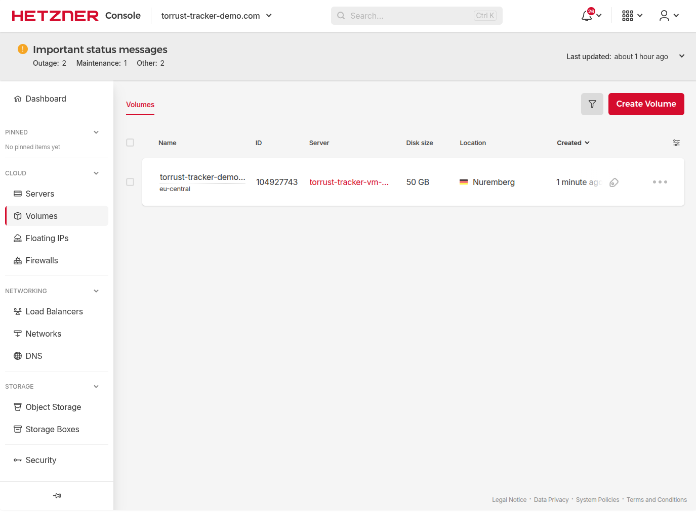
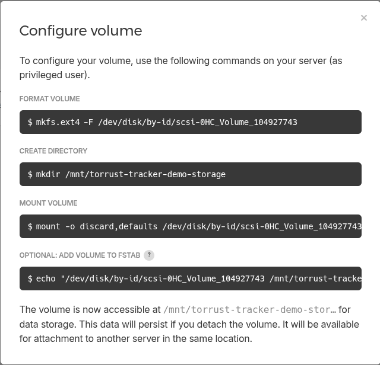

# Volume Setup

> **Status**: ✅ Done — volume created, attached, formatted, mounted and verified.

Create a Hetzner volume and mount it at `/opt/torrust/storage` on the server before running
`configure`.

## Why a Separate Volume?

The server's root disk contains the OS and application binaries. Persistent tracker data
(database, logs, Grafana state, Prometheus data) lives under `/opt/torrust/storage/`.

Putting that data on a separate Hetzner volume means:

- **Targeted backups**: back up only the volume, not the entire server.
- **Easy migration**: detach the volume and reattach to a new server if the VM is recreated.
- **Independent lifecycle**: you can snapshot or resize the volume without touching the server.

## Volume Specification

| Property    | Value                                                 |
| ----------- | ----------------------------------------------------- |
| Name        | `torrust-tracker-demo-storage`                        |
| Size        | 50 GB                                                 |
| Location    | `nbg1` (same as the server — required for attachment) |
| Format      | `ext4`                                                |
| Mount point | `/opt/torrust/storage`                                |

## Step 1: Create the Volume via Cloud API (2026-03-04)

The volume was created and attached using the **Hetzner Cloud API** — no UI needed.

### 1a: Create the volume

```bash
curl -s -X POST \
  -H "Authorization: Bearer $HCLOUD_TOKEN" \
  -H "Content-Type: application/json" \
  "https://api.hetzner.cloud/v1/volumes" \
  -d '{
    "name": "torrust-tracker-demo-storage",
    "size": 50,
    "location": "nbg1",
    "format": "ext4",
    "labels": {"project": "torrust-tracker-demo"}
  }'
```

Key fields in the response:

```json
{
  "volume": {
    "id": 104927743,
    "name": "torrust-tracker-demo-storage",
    "size": 50,
    "format": "ext4",
    "status": "creating",
    "linux_device": "/dev/disk/by-id/scsi-0HC_Volume_104927743",
    "location": { "name": "nbg1" },
    "server": null
  }
}
```

> **Note**: Passing `"format": "ext4"` in the create request tells Hetzner to format the
> volume automatically. This means **`mkfs.ext4` does not need to be run manually** — the
> volume arrives with a ready-to-use ext4 filesystem including a UUID.

### 1b: Find the server ID

```bash
curl -s -H "Authorization: Bearer $HCLOUD_TOKEN" \
  "https://api.hetzner.cloud/v1/servers?name=torrust-tracker-vm-torrust-tracker-demo"
```

Returned server `id=122663759`.

### 1c: Attach the volume to the server

```bash
curl -s -X POST \
  -H "Authorization: Bearer $HCLOUD_TOKEN" \
  -H "Content-Type: application/json" \
  "https://api.hetzner.cloud/v1/volumes/104927743/actions/attach" \
  -d '{"server": 122663759, "automount": false}'
```

Confirmed attached:

```bash
curl -s -H "Authorization: Bearer $HCLOUD_TOKEN" \
  "https://api.hetzner.cloud/v1/volumes/104927743" | \
  python3 -c "import sys,json; v=json.load(sys.stdin)['volume']; \
    print(f\"status={v['status']} server={v['server']} device={v['linux_device']}\")"
# status=available server=122663759 device=/dev/disk/by-id/scsi-0HC_Volume_104927743
```

The volume list is visible in the Hetzner Console under **Storage → Volumes**:



The console also shows a **Configure volume** popup with the recommended commands:



The popup suggests mounting at `/mnt/torrust-tracker-demo-storage`. We use `/opt/torrust/storage`
instead, to match the application's expected directory layout.

## Step 2: Verify Device on the Server (2026-03-04)

```bash
ssh -i ~/.ssh/torrust_tracker_deployer_ed25519 torrust@46.225.234.201 \
  'lsblk && echo "---blkid---" && sudo blkid /dev/disk/by-id/scsi-0HC_Volume_104927743'
```

Output:

```text
NAME    MAJ:MIN RM   SIZE RO TYPE MOUNTPOINTS
sda       8:0    0 152.6G  0 disk
|-sda1    8:1    0 152.3G  0 part /
|-sda14   8:14   0     1M  0 part
`-sda15   8:15   0   256M  0 part /boot/efi
sdb       8:16   0    50G  0 disk
sr0      11:0    1  1024M  0 rom
---blkid---
/dev/disk/by-id/scsi-0HC_Volume_104927743: UUID="6fb9df14-c744-4e50-a48d-9ca4522a02de" BLOCK_SIZE="4096" TYPE="ext4"
```

The volume appears as `/dev/sdb`, accessible via the stable symlink
`/dev/disk/by-id/scsi-0HC_Volume_104927743`. It is already formatted as `ext4` — Hetzner
handled that when we passed `"format": "ext4"` in the API create call.

## Step 3: Format the Volume

**Skipped** — the volume was formatted automatically by Hetzner when we passed `"format": "ext4"`
in the create request. UUID `6fb9df14-c744-4e50-a48d-9ca4522a02de` was confirmed by `blkid` above.

> If you create a volume **without** specifying `format` in the API (or via the UI with
> "leave unformatted"), run:
>
> ```bash
> sudo mkfs.ext4 -F /dev/disk/by-id/scsi-0HC_Volume_<ID>
> ```
>
> This matches the command shown in the Hetzner Console "Configure volume" popup.

## Steps 4–8: Mount, fstab, Ownership, Verify (2026-03-04)

All remaining steps were run in a single SSH session:

```bash
ssh -i ~/.ssh/torrust_tracker_deployer_ed25519 torrust@46.225.234.201 'bash -s' << 'ENDSSH'
set -e

DEVICE="/dev/disk/by-id/scsi-0HC_Volume_104927743"
MOUNT_POINT="/opt/torrust/storage"
UUID="6fb9df14-c744-4e50-a48d-9ca4522a02de"

# Step 4: Create mount point
sudo mkdir -p "$MOUNT_POINT"

# Step 5: Mount with discard,defaults (matches Hetzner's recommendation)
sudo mount -o discard,defaults "$DEVICE" "$MOUNT_POINT"
df -h "$MOUNT_POINT"

# Step 6: Add to fstab (UUID + discard,nofail,defaults)
echo "UUID=$UUID  $MOUNT_POINT  ext4  discard,nofail,defaults  0  2" | sudo tee -a /etc/fstab
grep "$UUID" /etc/fstab

# Step 7: Set ownership
sudo chown -R torrust:torrust "$MOUNT_POINT"
ls -la /opt/torrust/ | grep storage

# Step 8: Verify
mountpoint -q "$MOUNT_POINT" && echo "Mounted OK"
touch "$MOUNT_POINT/.volume-test" && echo "Write OK" && rm "$MOUNT_POINT/.volume-test"
ENDSSH
```

Output:

```text
Filesystem      Size  Used Avail Use% Mounted on
/dev/sdb         49G   24K   47G   1% /opt/torrust/storage
UUID=6fb9df14-c744-4e50-a48d-9ca4522a02de  /opt/torrust/storage  ext4  discard,nofail,defaults  0  2
drwxr-xr-x 3 torrust torrust 4096 Mar  4 11:38 storage
Mounted OK
Write OK
```

Then confirmed fstab survives reboot by unmounting and remounting via `mount -a`:

```bash
ssh -i ~/.ssh/torrust_tracker_deployer_ed25519 torrust@46.225.234.201 \
  'sudo umount /opt/torrust/storage && sudo mount -a && df -h /opt/torrust/storage && echo "fstab remount OK"'
```

Output:

```text
Filesystem      Size  Used Avail Use% Mounted on
/dev/sdb         49G   24K   47G   1% /opt/torrust/storage
fstab remount OK
```

## Outcome

✅ Volume `torrust-tracker-demo-storage` (50 GB, ext4) is mounted at `/opt/torrust/storage`,
owned by `torrust:torrust`, and will remount automatically on reboot. The next step is
[running the `configure` command](../commands/configure/).

## Problems

<!-- No issues encountered during volume setup. -->

## Improvements

- The `discard` mount option enables TRIM for SSD-backed volumes (Hetzner volumes are
  SSD-backed), which helps maintain performance over time. It is already included in both
  the mount command and the fstab entry above.
