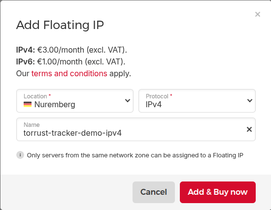
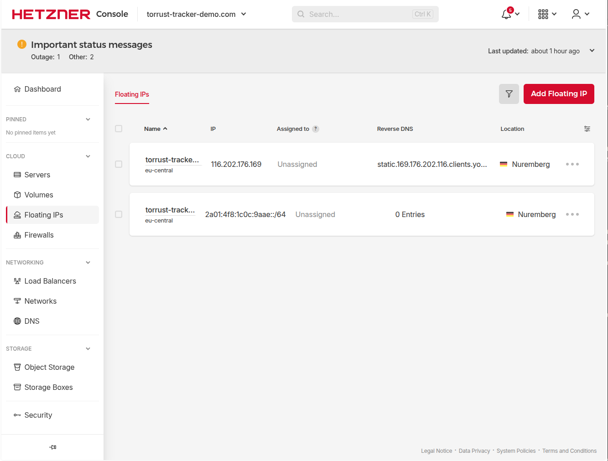
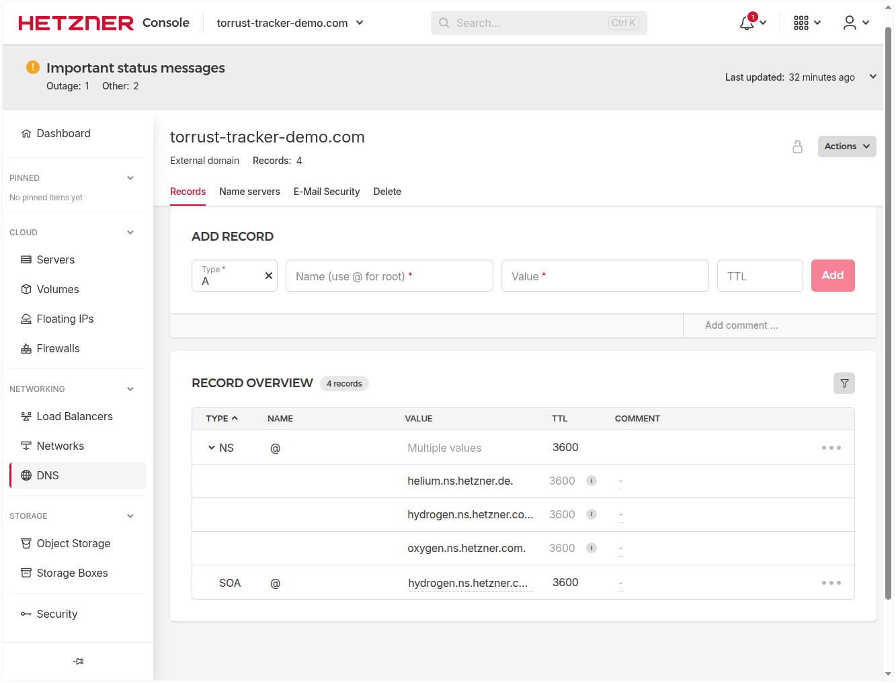

# Prerequisites

Checklist of everything needed before deploying the demo tracker to Hetzner Cloud.

## System

Commands in this guide were run on:

|                  |                         |
| ---------------- | ----------------------- |
| **OS**           | Ubuntu 25.10 (Questing) |
| **Kernel**       | Linux 6.17.0-14-generic |
| **Architecture** | x86_64                  |

## Accounts

- [x] **Hetzner Cloud account** — [Sign up](https://www.hetzner.com/cloud) if you don't have one
- [x] **Hetzner Cloud project** — Created project `torrust-tracker-demo.com` in [Hetzner Console](https://console.hetzner.cloud/) to group all resources for this deployment
- [x] **Hetzner API token** — Created in Hetzner Console → project `torrust-tracker-demo.com` → Security → API Tokens (Read & Write). Description: `Torrust Tracker Deployer - torrust-tracker-demo.com`
- [x] **Domain registrar access** — Domain `torrust-tracker-demo.com` registered at [cdmon.com](https://cdmon.com/). DNS servers changed to Hetzner:
  - `helium.ns.hetzner.de`
  - `hydrogen.ns.hetzner.com`
  - `oxygen.ns.hetzner.com`
- [x] **Hetzner DNS Zone** — DNS zone `torrust-tracker-demo.com` created in Hetzner Console

## SSH Keys

An SSH key pair is required for VM access. The deployer uses this to connect to the provisioned server.

```bash
# Generate a dedicated key pair (if you don't have one)
ssh-keygen -t ed25519 -C "torrust-tracker-deployer" -f ~/.ssh/torrust_tracker_deployer_ed25519
```

- [x] SSH private key available (`~/.ssh/torrust_tracker_deployer_ed25519`)
- [x] SSH public key available (`~/.ssh/torrust_tracker_deployer_ed25519.pub`)
- [x] Key permissions are correct (`chmod 600` on private key)
- [x] Passphrase set on private key

## Tools

The deployer supports two modes:

| Method     | Best for                             | Requires                |
| ---------- | ------------------------------------ | ----------------------- |
| **Docker** | End-users, reproducible environments | Docker only             |
| **Native** | Developers working from source       | Rust, OpenTofu, Ansible |

**Recommendation for end-users: use Docker** — one tool, no dependency management.

We are running from source (native), so we verified both.

### Docker

Pull the latest image first to ensure you have the most recent version:

```bash
docker pull torrust/tracker-deployer:latest
```

Output confirmed a fresh download:

```text
Status: Downloaded newer image for torrust/tracker-deployer:latest
Digest: sha256:01e3735b52bba1e733d422fe7cac918808d8e72da34c45b06c1a86ba8f33e119
```

Then verify the image works:

```bash
docker run --rm torrust/tracker-deployer:latest --help
```

The image starts, prints tool versions, and shows the CLI help. Tool versions inside the container:

- **OpenTofu**: `v1.11.2`
- **Ansible**: `core 2.19.5`
- **SSH**: `OpenSSH_9.2p1`

> **Note**: The Docker image only supports cloud providers (Hetzner). The LXD provider requires native installation.

- [x] **Docker** — `28.3.3` installed, latest image pulled and verified

### Native (used for this deployment)

All dependencies verified with:

```bash
cargo run -p torrust-dependency-installer --bin dependency-installer check
```

- [x] **Rust toolchain** — `rustc 1.96.0-nightly (ec818fda3 2026-03-02)`
- [x] **OpenTofu** — `v1.10.5`
- [x] **Ansible** — `core 2.19.0`
- [x] **cargo-machete** — `0.9.1`

## Working Directories

All three directories already existed in the repository. `envs/` permissions were tightened to `700` since it contains the environment config with the Hetzner API token.

```bash
chmod 700 envs
```

- [x] `data/` directory exists (`775`)
- [x] `build/` directory exists (`775`)
- [x] `envs/` directory exists with restricted permissions (`700`)

## Hetzner Infrastructure Resources

Beyond the server itself, we are setting up two additional Hetzner resources to make the deployment more robust and operationally flexible.

### Floating IPs (IPv4 and IPv6)

**Why floating IPs?**
Floating IPs are static IPs that are independent of the server. This means:

- If we resize or replace the server, we reassign the floating IP — no DNS change needed.
- The DNS records point to the floating IP permanently.

Floating IPs are created in Hetzner Console → project → Networking → Floating IPs, then assigned to the server after provisioning.

> **Important**: Floating IPs must be created in the **same location** (datacenter) as the server.

**Location chosen**: Nuremberg (`nbg1`) — same location we'll use for the server.

**Pricing**:

| Type | Monthly cost (excl. VAT) |
| ---- | ------------------------ |
| IPv4 | €3.00                    |
| IPv6 | €1.00                    |

**Names and addresses**:

| Name                        | Type | Address                   |
| --------------------------- | ---- | ------------------------- |
| `torrust-tracker-demo-ipv4` | IPv4 | `116.202.176.169`         |
| `torrust-tracker-demo-ipv6` | IPv6 | `2a01:4f8:1c0c:9aae::/64` |






- [x] IPv4 floating IP created in Hetzner project (`torrust-tracker-demo-ipv4`, `nbg1`, `116.202.176.169`)
- [x] IPv6 floating IP created in Hetzner project (`torrust-tracker-demo-ipv6`, `nbg1`, `2a01:4f8:1c0c:9aae::/64`)
- [ ] Both IPs assigned to the server (after provisioning)

### Volume for Storage (⚠️ deferred — do after `release`)

**Why a separate volume?**
The tracker's `storage/` directory holds all persistent data (SQLite database, logs, Grafana data, Prometheus data). Placing it on a dedicated Hetzner Volume means:

- Resize the server without touching the data.
- Create incremental volume backups without needing a full VM snapshot.
- Detach and reattach to a new server for disaster recovery.

> ⚠️ **This step is deferred** — the volume must be attached to a running server and mounted at `/opt/torrust/storage/` before the `release` command is run. See the deployment journal for the exact step.

- [ ] Volume created in Hetzner project (after server is provisioned)
- [ ] Volume attached to server and mounted at `/opt/torrust/storage/` (before `release`)

## DNS (after provisioning)

DNS records will be configured after we know the floating IP addresses. We need:

- [ ] A records for `torrust-tracker-demo.com` subdomains pointing to the **floating IPv4** address
- [ ] AAAA records for subdomains pointing to the **floating IPv6** address

### Initial DNS State (before deployment)

The zone was freshly created in Hetzner DNS with only the default SOA and NS records — no A records yet.



Records at zone creation (queried from `helium.ns.hetzner.de`):

```text
;; NS records
torrust-tracker-demo.com. 3600 IN NS helium.ns.hetzner.de.
torrust-tracker-demo.com. 3600 IN NS hydrogen.ns.hetzner.com.
torrust-tracker-demo.com. 3600 IN NS oxygen.ns.hetzner.com.

;; SOA record
torrust-tracker-demo.com. 3600 IN SOA hydrogen.ns.hetzner.com. dns.hetzner.com. (
                               2026030300 ; serial
                               86400      ; refresh (1 day)
                               10800      ; retry (3 hours)
                               3600000    ; expire (5 weeks 6 days 16 hours)
                               3600       ; minimum (1 hour)
                               )
```

## Related Documentation

- [Hetzner Cloud Provider guide](../../user-guide/providers/hetzner.md)
- [Quick Start: Docker Deployment](../../user-guide/quick-start/docker.md)
- [Quick Start: Native Installation](../../user-guide/quick-start/native.md)
