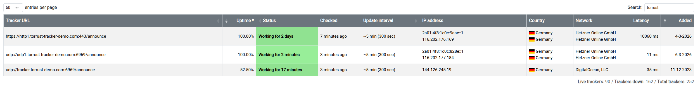

# Tracker Registry

Public tracker registries list open BitTorrent trackers so clients can
discover and use them. Submitting the demo tracker improves community
visibility and provides a passive uptime signal.

## newTrackon

[newTrackon](https://newtrackon.com/) continuously monitors the health of
submitted trackers and publishes them in public lists.

The previous Torrust demo tracker (`udp://tracker.torrust-demo.com:6969/announce`)
was already listed there. The new Hetzner demo tracker should be submitted as
well.

### Which trackers to submit

We submit two trackers from this deployment to public registries:

| Tracker        | URL                                                 | Status    |
| -------------- | --------------------------------------------------- | --------- |
| HTTP Tracker 1 | `https://http1.torrust-tracker-demo.com/announce`   | ✅ Listed |
| UDP Tracker 1  | `udp://udp1.torrust-tracker-demo.com:6969/announce` | ✅ Listed |

**HTTP Tracker 2**, **UDP Tracker 2**, the REST API, and Grafana are intentionally kept off
all public tracker lists. Once a tracker appears in public lists it receives a continuous stream
of announces from BitTorrent clients worldwide. That background noise makes it very hard to read
logs and debug issues when testing something in production. Keeping `http2` and `udp2` quiet
reserves them as low-traffic endpoints for manual testing and investigation.

### newTrackon Prerequisites

Before submitting a tracker to newTrackon, two prerequisites must be met:

#### 1. BEP 34 DNS TXT Record

[BEP 34](https://www.bittorrent.org/beps/bep_0034.html) requires a DNS TXT record on the
tracker domain declaring which ports it serves:

```text
"BITTORRENT UDP:<port> TCP:<port>"
```

For example, the old demo tracker has `"BITTORRENT UDP:6969 TCP:443"` on
`tracker.torrust-demo.com`. Without this record, newTrackon may reject the submission.

#### 2. Unique IP Address (One Tracker Per IP)

newTrackon only accepts one tracker per IP address. If two tracker URLs resolve to the same
IP(s), only one can be listed. Each submitted tracker must resolve to at least one IP not
already used by another listed tracker.

> **What we missed**: During the initial submission (2026-03-04) we did not add BEP 34 TXT
> records for either subdomain, and both `http1` and `udp1` shared the same two floating IPs.
> The HTTP1 tracker was accepted despite the missing TXT record; the UDP1 tracker was not.
> See [post-provision/newtrackon-prerequisites.md](post-provision/newtrackon-prerequisites.md)
> for the complete fix plan and current status.

### Submission History

#### HTTP Tracker 1

- **URL**: `https://http1.torrust-tracker-demo.com/announce`
- **Submitted**: 2026-03-04
- **Accepted**: ✅ Yes — listed on newTrackon
- **IPs at submission**: `116.202.176.169` (IPv4), `2a01:4f8:1c0c:9aae::1` (IPv6)

#### UDP Tracker 1

- **URL**: `udp://udp1.torrust-tracker-demo.com:6969/announce`
- **Submitted**: 2026-03-06 (attempt 3)
- **Accepted**: ✅ Yes — listed on newTrackon
- **IPs at submission**: `116.202.177.184` (IPv4), `2a01:4f8:1c0c:828e::1` (IPv6)
- **Notes**: Two blockers required fixing before acceptance:
  1. ufw was blocking IPv6 UDP 6969 — fixed with `sudo ufw allow 6969/udp`
  2. Policy routing tables (100/200) needed to ensure replies leave via the floating IP

  See [post-provision/ipv6-udp-tracker-issue.md](post-provision/ipv6-udp-tracker-issue.md) and
  [post-provision/newtrackon-prerequisites.md](post-provision/newtrackon-prerequisites.md).

### Final State — Both Trackers Listed (2026-03-06)



All three trackers visible in the screenshot:

| Tracker                                               | Notes                                 |
| ----------------------------------------------------- | ------------------------------------- |
| `https://http1.torrust-tracker-demo.com:443/announce` | This deployment — HTTP tracker        |
| `udp://udp1.torrust-tracker-demo.com:6969/announce`   | This deployment — UDP tracker         |
| `udp://tracker.torrust-demo.com:6969/announce`        | Previous Torrust demo (Digital Ocean) |

### How to submit

1. Ensure all prerequisites are met (see section above and
   [post-provision/newtrackon-prerequisites.md](post-provision/newtrackon-prerequisites.md))
2. Go to <https://newtrackon.com/>
3. Paste the tracker URL into the submission box
4. Click **Submit**
5. Wait a few minutes while newTrackon probes the tracker
6. Verify it appears in the [tracker list](https://newtrackon.com/list)

You can also verify via the newTrackon API:

```bash
curl -s https://newtrackon.com/api/stable
```
